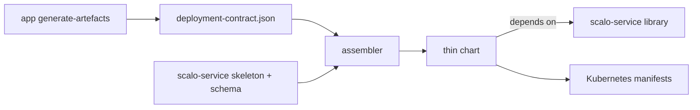

# scalo-service

A Helm library chart that renders a Kubernetes service from its deployment contract. The service's own chart is thin: the contract, one-line includes, and values. Every object comes from here.



The contract is the JSON `scalo::deployment::DeploymentContract` serialises, at `schema_version` 4. Its JSON Schema ships here as `schema/deployment-contract.v4.schema.json`, derived from the Rust types. scalo-py emits the same shape, and a service in any other language writes the file by hand.

## Package layout

| Path | Holds |
| --- | --- |
| `templates/_*.tpl` | The named templates, all `scalo-service.*` |
| `schema/deployment-contract.v<N>.schema.json` | The contract schema per `schema_version`; a released version only widens |
| `skeleton/Chart.yaml` | The thin chart's `Chart.yaml`, before an assembler fills it in |
| `skeleton/templates/*.yaml` | One `include` per object |
| `skeleton/values.schema.json` | The schema of the standard values; it never declares `config` |
| `lint-skip.yaml` | Scanner findings a thin chart accepts by design, keyed by scanner and check id, each with its reason; an assembler applies them to the thin chart only |
| `tests/` | Fixture thin charts, helm-unittest suites and expected-fail cases; not packaged |

## The thin chart

```text
my-app/
  Chart.yaml            name, version, appVersion, dependency on scalo-service
  files/contract.json   the app's deployment contract
  templates/*.yaml      copied from skeleton/templates, one include each
  values.yaml           the image digest, an empty config, dials commented out
  values.schema.json    skeleton/values.schema.json plus config.<dial> leaves
```

The library reads `files/contract.json` from the thin chart, not from itself, so one library serves every service. A thin chart holds no logic: a fix to how an object renders is a library release, and every service picks it up by bumping the dependency.

## Assembling a thin chart

A release pipeline runs these steps after it builds the image. Nothing here depends on a particular tool: they reproduce a thin chart by hand or in any language.

1. **Validate the contract.** Pick `schema/deployment-contract.v<N>.schema.json` for the contract's `schema_version`. No such file means this library release cannot render that contract. The contract must validate against it without error.
2. **Copy the skeleton.** Copy `skeleton/` to a directory named after the contract's `app_name`.
3. **Write `files/contract.json`.** The contract, byte for byte as the service emitted or committed it.
4. **Fill in `Chart.yaml`.** Set `name` to `app_name`, `version` to the service's release version, and `appVersion` to the image tag exactly as pushed, `v` included. Set `description` to the contract's when it has one. Replace `dependencies` with one entry: `name: scalo-service`, the library `version`, and the `repository` it is pulled from.
5. **Find the dials.** A contract with no `config_schema`, or a null one, has none. Otherwise walk it from its root, carrying a dotted path:
   - a node carrying `x-scalo-dial` is a dial at the current path, recorded once, and nothing beneath it is walked; its value must be `big` or `small`
   - a `$ref` is followed to its target at the same path, at most once per reference along one branch
   - each `properties` entry is walked at `<path>.<name>`, in name order
   - each `allOf`, `anyOf` and `oneOf` branch is walked at the same path

   `scalo::deployment::dials` is this walk, and the test suite checks the fixtures against it.
6. **Inline each dial.** Replace every local `$ref` inside a dial with its target, keys on the node beside the `$ref` winning. Keep every constraint (`minimum`, `maximum`, `enum`, `pattern`, `default`) and the `x-scalo-dial` marker.
7. **Write `values.schema.json`.** Start from `skeleton/values.schema.json`, the fragment. Add `properties.config` as `{"type": "object"}`, and for each dial path `a.b.c` nest `properties.a` and `properties.b` as `{"type": "object"}` objects under it and set `properties.c` to the inlined dial. When the fragment has no top-level `$schema`, set it to the `$schema` of the contract's `config_schema`. A fragment that already declares `properties.config` is an error.
8. **Write `values.yaml`.** `config: {}`, `image.digest` set to the digest built for the tag, and one comment line per dial, `# config.<path>: <default>  # <tier>`, so an operator sees what can be tuned without it being set.

Write the files these steps derive (`Chart.yaml`, `values.schema.json`, `values.yaml`) with sorted keys and no timestamp, so one assembler given the same inputs writes the same bytes. Two assemblers may differ in comments and layout, never in what the chart renders.

Before rendering a thin chart, fetch the library into its `charts/` with `helm dependency build`.

Config keys that are not dials still reach the app, through `config` or `configOverrides`, but the schema does not validate them. A stored overlay therefore never pins a key a later app release drops.

## What the library renders

| Object | Name | When |
| --- | --- | --- |
| Deployment | `<fullname>` | always |
| Service | `<fullname>` | always: the metrics port, named `metrics`, plus every open port |
| Service | `<fullname>-public`, `<fullname>-public-udp` | `publicService.enabled`, for ports the contract marks `public` |
| ConfigMap | `<fullname>-config` | the contract names a `config_mount_path` |
| ConfigMap | `<fullname>-<set>` | per `fileSets` entry |
| ServiceAccount | `serviceAccount.name`, else `<fullname>` | unless `serviceAccount.create: false` |
| PersistentVolumeClaim | `<fullname>-<path name>` | per persistent writable path without `existingClaim` |
| PodDisruptionBudget | `<fullname>` | `replicaCount` or the autoscaler floor is two or more, never for a singleton |
| ScaledObject | `<fullname>-scaler` | KEDA on |
| TriggerAuthentication | `<fullname>-trigger-auth` | KEDA on and `keda.triggerAuthentication.secretTargetRef` set |
| HorizontalPodAutoscaler | `<fullname>` | `autoscaling.enabled` with KEDA off |
| NetworkPolicy | `<fullname>` | `networkPolicy.enabled` |
| anything | as given | each `extraObjects` entry |

`<fullname>` is `fullnameOverride`, else the chart name. The release name is never part of it. The Deployment selector is `app.kubernetes.io/name: <fullname>` and nothing else, because a selector is immutable and any other label in it would force every Deployment to be deleted and recreated. A service that runs several instances gives each its own `fullnameOverride`.

A persistent writable path is a claim beside a Deployment that recreates its pod, not a StatefulSet: the claim keeps the name `<fullname>-<path name>` across upgrades, where a StatefulSet's claim template names claims after the set and the ordinal.

## Contract fields the library reads

| Field | Renders | When absent |
| --- | --- | --- |
| `app_name` | the chart name, so every object's name; image repository `<registry>/<app_name>` | required; a Kubernetes Service name: 1 to 63 lowercase letters, digits and inner hyphens, starting with a letter |
| `image_registry` | image registry | `image.registry` or `global.registry` must be set |
| `metrics_port`, `health.*` | metrics port, the three probes, scrape annotations | required |
| `health.startup_budget_seconds` | startup probe `failureThreshold`, at a 5 s period | 150 |
| `extra_ports[]` | container and Service ports, `appProtocol`, public load balancers | none |
| `extra_ports[].when`, `writable_paths[].when` | the port or path only while the condition holds | always |
| `config_mount_path` | the config ConfigMap and its mount | no config file |
| `entrypoint_args` | container `args` | none |
| `env_prefix` | `<env_prefix>_VERSION_CHECK__*` | required; an empty prefix gives bare `VERSION_CHECK__*` |
| `secrets[]` | one `secretKeyRef` per variable, `optional` where the group is | none |
| `keda` | ScaledObject bounds and triggers | KEDA off |
| `writable_paths[]` | emptyDir or claim per path; `/tmp` is always added | `/tmp` only |
| `termination_grace_seconds` | `terminationGracePeriodSeconds` | 45 |
| `resources` | requests and limits over the library default | 100m / 128Mi requested, 500m / 512Mi limit |
| `security` | uid, gid, fsGroup, read-only root filesystem, added capabilities | 1000, 1000, 1000, read-only, none |
| `singleton` | one replica, Recreate, no autoscaler, no budget | false |

A condition reads its `path` from values. A path under `config.` reads the config the app ends up running: the contract's `default_config`, then `config`, then `configOverrides`. So a port the app opens by default is open without anyone setting it. A missing or null value never satisfies a condition.

`default_config` is never rendered into the ConfigMap. The file holds only what values set, and the app's own defaults stay authoritative.

## Values

| Key | Default | Purpose |
| --- | --- | --- |
| `fullnameOverride` | chart name | Name of every object; a Kubernetes Service name, as `app_name` |
| `partOf` | none | `app.kubernetes.io/part-of` |
| `commonLabels`, `commonAnnotations` | `{}` | On every object; label values through `tpl`; the standard labels win a collision |
| `podLabels`, `podAnnotations` | `{}` | On the pod template; the selector label always wins |
| `global.registry`, `image.registry` | contract `image_registry` | Image registry |
| `image.repository` | `<registry>/<app_name>` | Replaces the whole repository |
| `image.tag` | `appVersion` | Image tag |
| `image.digest` | none | `sha256:...`, appended as `tag@digest` |
| `image.pullPolicy` | `IfNotPresent` | |
| `imagePullSecrets` | `[]` | Names, or `{name}` entries |
| `replicaCount` | 1 | Pods while nothing autoscales the workload |
| `resources` | contract, then library default | Requests and limits; an empty string drops an entry |
| `terminationGracePeriodSeconds` | contract | Read with `hasKey`, so 0 holds |
| `strategy` | derived | Replaces the derived Recreate or surge-first strategy |
| `keda.enabled` | contract | KEDA on or off |
| `keda.minReplicaCount`, `maxReplicaCount`, `idleReplicaCount`, `pollingInterval`, `cooldownPeriod` | contract | ScaledObject bounds |
| `keda.cpu.enabled`, `keda.cpu.targetUtilization` | contract `cpu_enabled`, `cpu_threshold` | CPU trigger |
| `keda.kafka.enabled`, `lagThreshold`, `activationLagThreshold` | contract | Kafka lag trigger |
| `keda.triggers` | none | Replaces every derived trigger |
| `keda.extraTriggers` | `[]` | Appended after the derived triggers |
| `keda.triggerAuthentication.secretTargetRef` | none | Renders a TriggerAuthentication the Kafka trigger references |
| `autoscaling.enabled`, `minReplicas`, `maxReplicas`, `targetCPUUtilizationPercentage` | off, 1, 10, 80 | CPU HPA while KEDA is off |
| `pdb.enabled`, `pdb.minAvailable`, `pdb.maxUnavailable` | on, derived | Disruption budget |
| `podSecurityContext` | from contract `security` | Merged over; `enabled: false` drops it |
| `containerSecurityContext` | from contract `security` | Merged over |
| `nodeSelector`, `tolerations`, `affinity`, `topologySpreadConstraints`, `priorityClassName` | none | Scheduling |
| `workingDir`, `args` | none, contract `entrypoint_args` | Container |
| `startupProbe`, `livenessProbe`, `readinessProbe` | derived | Merged over each probe |
| `config` | `{}` | App config file; dials are validated, other keys pass |
| `configOverrides` | `{}` | Merged over `config`, unvalidated |
| `configMount.subPath` | false | Mount the config as one file rather than its directory |
| `fileSets.<set>.mountPath`, `fileSets.<set>.files[{name, content}]` | none | Files mounted read-only from a ConfigMap |
| `writablePaths.<name>.enabled`, `.sizeLimit` | on, contract | Per contract path |
| `writablePaths.<name>.persistence.enabled`, `.size`, `.storageClass`, `.accessModes`, `.existingClaim`, `.annotations` | contract, `[ReadWriteOnce]` | The path's claim |
| `secrets.<group>.enabled`, `.existingSecret`, `.keys.<key_name>`, `.optional` | on, `<fullname>-<group>`, contract `secret_key`, contract | Per contract secret group; `existingSecret` through `tpl` |
| `service.type`, `service.annotations` | `ClusterIP` | In-cluster Service |
| `publicService.enabled`, `type`, `loadBalancerIP`, `loadBalancerClass`, `loadBalancerSourceRanges`, `externalTrafficPolicy`, `annotations` | off, `LoadBalancer` | Load balancers for public ports |
| `networkPolicy.enabled`, `from`, `publicFrom` | off, the namespace, any source | Ingress policy |
| `serviceAccount.create`, `name`, `mountToken`, `annotations` | true, fullname, false | Service account; the token stays unmounted unless asked |
| `extraEnv` | `{}` | Env by name: a scalar through `tpl`, an object as its `valueFrom`; a name the chart derives is dropped |
| `extraEnvFrom`, `extraVolumes`, `extraVolumeMounts`, `initContainers`, `sidecars` | `[]` | Passed through `tpl` |
| `extraPorts[{name, port, protocol, appProtocol, public}]` | `[]` | Ports beside the contract's, on the container and Services |
| `extraObjects` | `[]` | Extra documents, maps or strings, through `tpl` |
| `otel.endpoint`, `otel.protocol`, `otel.serviceName` | none, `grpc`, fullname | OTLP export env |
| `telemetry.prometheus.scrape` | true | Scrape annotations |
| `versionCheck.enabled`, `sendInstanceId`, `apiUrl`, `instanceId` | unset | Version-check env, each only when set |
| `reload.enabled`, `reload.secrets`, `reload.configmaps` | off | Stakater Reloader annotations |

`skeleton/values.schema.json` types these keys and marks the platform dials (`replicaCount`, `resources`, `keda`, `autoscaling`, `terminationGracePeriodSeconds`, `pdb` big; probes, scheduling, `otel`, `versionCheck`, `reload` small) with the same `x-scalo-dial` keyword app dials carry. Objects stay open to keys it does not list.

## Compatibility

`schema_version` is the handshake. A released `schema/deployment-contract.v<N>.schema.json` only widens: a field is added, a constraint loosens. A change that would refuse a contract the released file accepted goes into `v<N+1>`, with the library reading both.

`skeleton/values.schema.json` follows the same rule, because a narrowed constraint fails every render of an overlay that already stores the old value. It may break only beside a `schema_version` bump.

`scripts/schema-breaking-check.sh` holds both rules in CI against the last release tag. It reports a removed or renamed field, a narrowed type or enum, a tightened bound or a new pattern, a newly required field, closed properties, a lost `anyOf` branch, and a removed dial. The comparison is `scalo::deployment::breaking_changes`, which a service can run on its own `config_schema`.

## Testing

```bash
charts/scalo-service/tests/run.sh
```

It installs the pinned helm, helm-unittest and kubeconform into `~/.cache/scalo-rs/chart-tools` (or `SCALO_CHART_TOOLS`), then for each thin chart under `tests/fixtures/` checks it matches the skeleton, runs `helm lint --strict` and the helm-unittest suites, and renders the defaults and each `ci/*-values.yaml` through `kubeconform -strict`. Each case under `tests/expected-fail/` swaps a contract or values into a fixture and must be refused with the message its `case` file names.

The chart is Apache-2.0, as scalo is.
