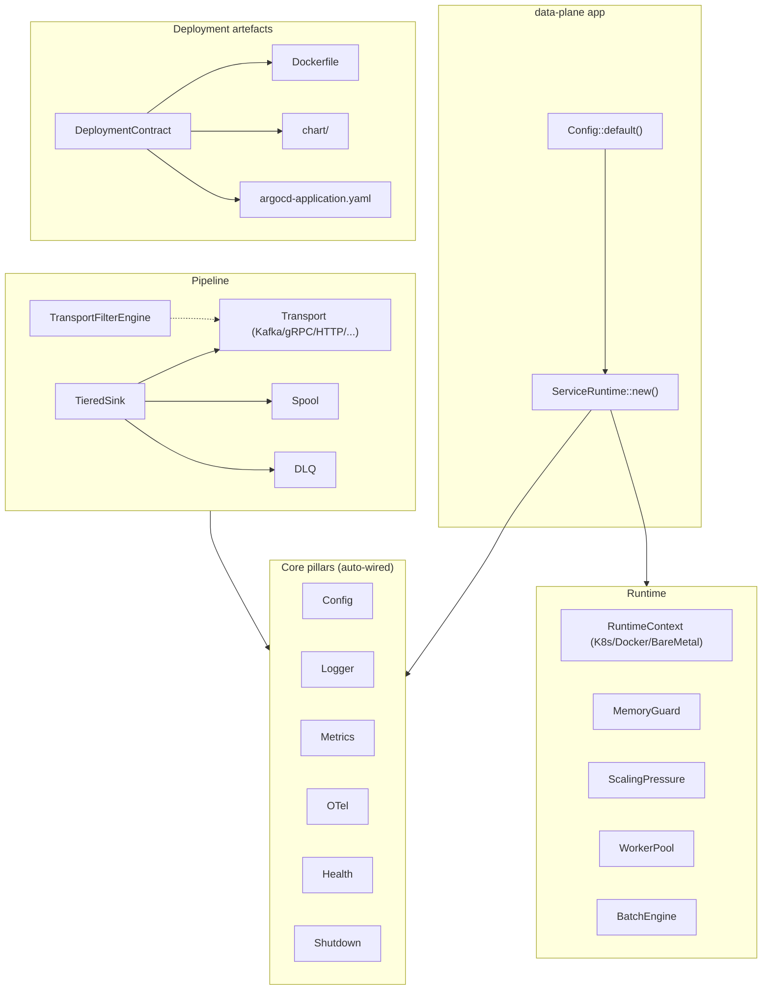

# scalo docs

Shared Rust library for data-plane services. Wire three lines at startup and you
get config cascade, structured logs, Prometheus metrics, health probes, OTel
traces, graceful shutdown, K8s pre-stop, and deployment-artefact generation
for free. Add a `Transport`, a `TieredSink`, a `BatchEngine` and the same
deal extends: counters, span propagation, DLQ routing, backpressure, scaling
signals - all automatic.

This is the index. Read [architecture.md](architecture.md) for the
10,000-foot view of how the modules fit together, [integration.md](integration.md)
for a recipe walkthrough on building a data-plane service, [auto-wiring.md](auto-wiring.md)
for the "you-get-this-for-free" model, and [feature-flags.md](feature-flags.md)
for how features cascade into one another.

---

## What you get for free

| Wire this at startup | And these come along | No need to |
|----------------------|----------------------|------------|
| `config::setup(opts)` | 7-layer cascade, env-var nesting, `.env`, sensitive masking, hot-reload, `/config` admin endpoint, section registry | Wire figment, write a settings loader, build a reload watcher |
| `logger::setup_default()` | Structured tracing, JSON or text picked from the OTEL endpoint, CI and the terminal, colour only on a terminal, RFC 3339 timestamps, sensitive-field masking, flooding helpers | Install a tracing subscriber, format JSON, pick a logger crate |
| `MetricsManager::new("app")` | Prometheus exporter, `/metrics` endpoint, process metrics, cardinality cap, `/metrics/manifest` catalogue | Stand up an exporter, wire a process collector, hand-roll a manifest |
| `ServiceRuntime::new(...)` | All of the above + memory guard + scaling pressure + worker pool + batch engine + shutdown token + K8s pre-stop delay + runtime context | Glue them together manually; six modules wire themselves |
| Any `Transport` impl | 3-tier filter engine, DLQ routing, per-direction/action metrics, W3C traceparent propagation | Add filters, wire DLQ, instrument send/recv |
| `TieredSink::new(...)` | Transport + disk-spillover spool + circuit breaker + retry + DLQ fallback + backpressure signal | Compose those primitives by hand |

That's the value proposition. Everything else in these docs is "and here's
how the pieces work".

---

## 10,000-foot view

Solid arrows are runtime data/control flow. Dashed arrows mark embedded
sub-components (filter engine lives inside every transport).

---

## Where to read what

### Start here

- [architecture.md](architecture.md) - module map, dependency graph, layering
- [integration.md](integration.md) - "I'm building a data-plane app" walkthrough
- [auto-wiring.md](auto-wiring.md) - what's wired into what, and why
- [feature-flags.md](feature-flags.md) - feature tree, native deps, recommended bundles

### Data plane (WorkBatch + self-regulation)

- [self-regulation.md](self-regulation.md) -- ON by default; the three brains (MemoryGuard / ScalingPressure / UnifiedPressure), observe + tune
- [backpressure.md](backpressure.md) -- gate the source never the sink; the per-stage brake/commit-token table; streaming sub-blocks
- [kafka-path.md](kafka-path.md) -- the three batch sizes, sizing profiles + librdkafka names, how the byte budget moves, partition-limited diagnostic

### Core pillars (always-on, auto-wired)

Section landing: [core-pillars/README.md](core-pillars/README.md)

- [core-pillars/config.md](core-pillars/config.md) - 7-layer cascade, hot-reload, registry, `/config` endpoint
- [core-pillars/logging.md](core-pillars/logging.md) - tracing setup, JSON/text autodetect, masking, flood control
- [core-pillars/metrics.md](core-pillars/metrics.md) - Prometheus, manifest, cardinality cap
- [core-pillars/tracing.md](core-pillars/tracing.md) - OTel, W3C traceparent, transport propagation
- [core-pillars/health.md](core-pillars/health.md) - `HealthRegistry`, `/livez` / `/readyz`
- [core-pillars/shutdown.md](core-pillars/shutdown.md) - `CancellationToken`, K8s pre-stop delay
- [core-pillars/lifecycle.md](core-pillars/lifecycle.md) - idle until configured, `WorkState`, `pipeline_idle`

### Runtime

Section landing: [runtime/README.md](runtime/README.md)

- [runtime/service-runtime.md](runtime/service-runtime.md) - `ServiceRuntime`, `ServiceApp` trait, `run_app`
- [runtime/runtime-context.md](runtime/runtime-context.md) - K8s/Docker/BareMetal detection, pod metadata
- [runtime/memory.md](runtime/memory.md) - `MemoryGuard`, cgroup-aware backpressure

### Transport

- [transport/README.md](transport/README.md) - trait architecture, factory, `AnySender`, commit tokens
- [transport/backends.md](transport/backends.md) - Kafka, gRPC, Memory, File, Pipe, HTTP
- [transport/filter-engine.md](transport/filter-engine.md) - 3-tier filter (SIMD / compiled CEL / complex CEL)
- [transport/routing.md](transport/routing.md) - `RoutedSender`, the named sink set: routes, fan-out

### Deployment

Section landing: [deployment/README.md](deployment/README.md)

- [deployment/contract.md](deployment/contract.md) - `DeploymentContract` struct, schema versioning
- [deployment/artefacts.md](deployment/artefacts.md) - generated Dockerfile, Helm chart, ArgoCD Application
- [deployment/native-deps.md](deployment/native-deps.md) - `NativeDepsContract`, feature -> APT package map
- [deployment/keda.md](deployment/keda.md) - `KedaContract`, scaler triggers, fallback HPA

### Pipeline

Section landing: [pipeline/README.md](pipeline/README.md)

- [pipeline/batch-engine.md](pipeline/batch-engine.md) - SIMD parse, pre-route filter, field interning
- [pipeline/worker-pool.md](pipeline/worker-pool.md) - `AdaptiveWorkerPool`, pressure-based scaling
- [pipeline/tiered-sink.md](pipeline/tiered-sink.md) - resilient delivery, disk spillover, circuit breaker
- [pipeline/sink-stack.md](pipeline/sink-stack.md) - outbound control stack: timeout / load-shed / concurrency / retry / rate-limit
- [pipeline/dlq.md](pipeline/dlq.md) - file, Kafka, HTTP backends
- [pipeline/spool.md](pipeline/spool.md) - disk-backed async FIFO (yaque)
- [pipeline/strmatch.md](pipeline/strmatch.md) - 4-tier regex->fast-path matcher (Byte / Literal / LiteralSet / Regex)
- [pipeline/scaling.md](pipeline/scaling.md) - `ScalingPressure`, KEDA external scaler signal

### Less-common subsystems

Section landing: [api/README.md](api/README.md)

- [api/secrets.md](api/secrets.md) - OpenBao/Vault, AWS Secrets Manager
- [api/http-server.md](api/http-server.md) - axum server, probe wiring, route extensions
- [api/http-client.md](api/http-client.md) - `reqwest` + retry + circuit breaker
- [api/directory-config.md](api/directory-config.md) - YAML directory store with optional `git2`
- [api/concurrency.md](api/concurrency.md) - `BackgroundSink`, `PeriodicWorker`, `ActorHandle`
- [version-check.md](version-check.md) - opt-out startup version check

### Planned (not in current release)

- **Content-based log scrubbing** (gitleaks rules + PII validators
  composed via `strmatch`). The current release ships field-name
  masking via `MaskingWriter` only - see
  [core-pillars/logging.md](core-pillars/logging.md) for what's
  shipped.
- **`cache` module** (moka TinyLFU async cache). Documented in
  [api/cache.md](api/cache.md) but not currently built into the crate;
  there is no `cache` feature or `scalo::cache` module in this release.

### Workflow artefacts (not user docs)

- [migrations.md](migrations.md) - API surface changes by scalo version; consumer-rebuild playbook

---

## Project facts

- **Crate:** [scalo](https://crates.io/crates/scalo) (crates.io)
- **Edition:** 2024
- **MSRV:** see `rust-version` in `Cargo.toml`
- **Used by:** several downstream data-plane services (Kafka-to-ClickHouse loaders, gRPC/pull-mode ingress, long-term archivers, VRL/Vector transform apps)
- **Sibling lib:** [scalo-py](https://github.com/hyperi-io/scalo-py) (Python control-plane equivalent)
