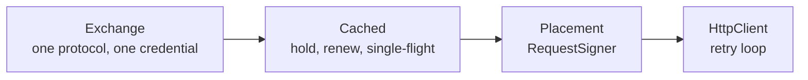

# Credentials: acquisition and placement

`auth` gets a credential and puts it on a request. It is the shared half
of provider authentication -- the caching, the renewal, the single-flight
gate, the token-response reading, and the four or five places a provider
might want the credential to appear. It carries no signing scheme and no
crypto dependency.

Feature: `auth`. Off by default. Pulls `http`, because an exchange rides
the shared `HttpClient`.

```toml
[dependencies.scalo]
version = "2"
features = ["auth"]
```

---

## The two halves

They compose, and neither knows about the other.



**Acquisition.** An `Exchange` obtains one credential, once, over one
protocol. It holds no state and does no caching. `Cached` wraps any
exchange and owns all of that.

**Placement.** A placement is a
[`RequestSigner`](http-client.md#signing-a-request) over a credential
source. It runs per attempt on the built request, so the credential on a
retry is the current one.

---

## Usage

```rust
use std::sync::Arc;

use scalo::auth::{Cached, ClientCredentials, HeaderPlacement};
use scalo::http_client::HttpClient;
use scalo::sensitive::SensitiveString;

let http = Arc::new(HttpClient::from_cascade()?);
let source = Arc::new(Cached::new(
    ClientCredentials::new(
        Arc::clone(&http),
        "https://idp.example/oauth2/token",
        "client-42",
        SensitiveString::new("resolved-by-the-consumer"),
    )
    .with_scope("events:read"),
));

let resp = http
    .get_signed(
        "https://api.example/v1/events",
        &HeaderPlacement::bearer(Arc::clone(&source)),
    )
    .await?;
```

Share one `Arc<Cached<_>>` across every call site that wants the same
credential. A hit is an atomic load and a pointer clone: no lock, no
allocation, and it never parks.

---

## Exchanges

Every value an exchange holds is already rendered. Templating, secret
resolution and per-deployment substitution happen in the consumer before
the exchange is built.

| Exchange | Protocol |
|---|---|
| `Static` | No I/O. A key the consumer already resolved, held for the life of the process |
| `ClientCredentials` | OAuth2 client credentials (RFC 6749 s4.4) -- a form POST of `grant_type`, `client_id`, `client_secret`, optional `scope` |
| `TokenPost` | A form POST of exactly the fields handed to it -- the generic shape |
| `MetadataServer` | A GET, optionally behind a header (`Metadata-Flavor: Google`) |

`TokenPost` is how a signed client assertion (RFC 7523) or a session
login reaches a token endpoint: the consumer mints and signs the
assertion with whatever key format it has, and hands it in as a rendered
form value. No JWT library and no key parsing enters scalo.

All three HTTP exchanges post or get through the shared `HttpClient`, so
a token endpoint gets the same timeouts and connection pool as every
other call. A GET exchange is retried; a POST exchange follows the
client's `retry_non_idempotent` setting, which is off by default.

### Reading a token response

`TokenReading` is the response contract, shared by all three:

- `access_token` is required; anything else is a malformed response,
  named as such rather than cached as an empty credential.
- `expires_in` is read whether the provider sent it as a number or as a
  numeric string. Both are in the wild.
- A response with no `expires_in` takes the configured fallback rather
  than renewing on every call.
- The renewal point is the lifetime less the renew margin, so a request
  signed now is not signed with a credential that expires in flight.
- Named top-level fields ride along in `Credential::extra` -- a Salesforce
  `instance_url`, a provider's own `resource` -- and nothing else does.

---

## Placements

| Placement | Puts the credential |
|---|---|
| `HeaderPlacement::bearer(source)` | `Authorization: Bearer <secret>` |
| `HeaderPlacement::new(name, prefix, source)` | `<name>: <prefix><secret>`, prefix empty for the providers wanting a bare key |
| `QueryPlacement::new(name, source)` | `?<name>=<secret>`, appended to the built URL so the URL a caller logs never carries it |
| `BasicPlacement::new(username, source)` | HTTP basic auth, credential as the password |

A header placement marks its value sensitive, so the `http` crate's own
`Debug` renders it as `Sensitive` wherever a request is formatted.

### Two headers, one exchange

A provider wanting two headers is two placements over one source. A
tuple is itself a signer, so this needs no new type and no `dyn`:

```rust
use reqwest::header::HeaderName;

let signer = (
    HeaderPlacement::new(HeaderName::from_static("dd-api-key"), "", Arc::clone(&source)),
    HeaderPlacement::new(HeaderName::from_static("dd-application-key"), "", Arc::clone(&source)),
);
let resp = http.get_signed(url, &signer).await?;
```

Both headers land on one request and cost one exchange.

---

## Renewal and single-flight

`Cached::credential()` is the whole policy:

1. Load the held credential. Not yet due -- return it. One atomic load, a
   pointer clone, no allocation, no park.
2. Otherwise take the renewal lock, and **re-check**: another task may
   have renewed while this one waited.
3. Otherwise exchange once, store the new credential whole, return it.

The lock is taken only on a miss, and it is the async mutex because the
wait it guards is the exchange itself. A cold source hit by a hundred
callers at once mints once.

The held credential is an `ArcSwapOption`: read-mostly state swapped
whole, which is what the memory rubric wants here and why it is not a
`RwLock<Arc<_>>`.

---

## What stays with the consumer

- **Templating and secret resolution.** An exchange takes rendered
  values. Where they came from -- config, a vault, an env var -- is the
  consumer's business.
- **Signing schemes.** SigV4 and a request HMAC pull crypto crates in for
  the one consumer that needs them, so they stay there as further
  implementations of `RequestSigner` rather than as a dependency for
  every consumer that does not.
- **The Kafka `OAUTHBEARER` token refresh callback.** A credential source
  is the right input to it, but the callback itself belongs to the
  transport, not here.

---

## Related

- [http-client.md](http-client.md) -- the retry loop and the `RequestSigner` hook
- [secrets.md](secrets.md) -- where a resolved secret comes from
- [../feature-flags.md](../feature-flags.md) -- `auth`
- Source: [../../src/auth/](../../src/auth/)
