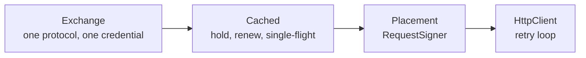

# Credentials: acquisition and placement

`auth` gets a credential and puts it on a request. It is the shared half
of provider authentication -- the caching, the renewal, the single-flight
gate, the token-response reading, and putting the credential in a header,
a query parameter or basic auth. It carries no signing scheme and no
crypto dependency.

Feature: `auth`. Off by default. Pulls `http`, because an exchange is an
`HttpClient` call and a placement is its signing hook.

```toml
[dependencies.scalo]
version = "2"
features = ["auth"]
```

---

## The two halves

They compose, and neither knows about the other.



**Acquisition.** An `Exchange` obtains one credential, once, over one
protocol. It holds no state and does no caching. `Cached` wraps any
exchange and owns all of that.

**Placement.** A placement is a
[`RequestSigner`](http-client.md#signing-a-request) over a credential
source. It runs per attempt on the built request, so the credential on a
retry is the current one.

---

## Usage

```rust
use std::sync::Arc;

use scalo::auth::{Cached, ClientCredentials, HeaderPlacement};
use scalo::http_client::HttpClient;
use scalo::sensitive::SensitiveString;

let http = Arc::new(HttpClient::from_cascade()?);
let source = Arc::new(Cached::new(
    ClientCredentials::new(
        &http,
        "https://idp.example/oauth2/token",
        "client-42",
        SensitiveString::new("resolved-by-the-consumer"),
    )?
    .with_scope("events:read"),
));

let resp = http
    .get_signed(
        "https://api.example/v1/events",
        &HeaderPlacement::bearer(Arc::clone(&source)),
    )
    .await?;
```

Share one `Arc<Cached<_>>` across every call site that wants the same
credential. A hit is an atomic load and a pointer clone: no lock, no
allocation, and it never parks.

---

## Exchanges

Every value an exchange holds is already rendered. Templating, secret
resolution and per-deployment substitution happen in the consumer before
the exchange is built.

| Exchange | Protocol |
|---|---|
| `Static` | No I/O. A key the consumer already resolved, held for the life of the process |
| `ClientCredentials` | OAuth2 client credentials (RFC 6749 s4.4) -- a form POST of `grant_type`, `client_id`, `client_secret`, optional `scope` |
| `TokenPost` | A form POST of exactly the fields handed to it -- the generic shape |
| `MetadataServer` | A GET, optionally behind a header (`Metadata-Flavor: Google`) |

`TokenPost` is how a signed client assertion (RFC 7523) or a session
login reaches a token endpoint: the consumer mints and signs the
assertion, and hands it in as a rendered form value. No JWT library and
no key parsing enters scalo.

### The client an exchange uses

The `HttpClient` handed to an exchange is the settings it takes, not the
client it calls on: it builds its own from them, with two deliberate
differences.

- **Redirects refused.** reqwest carries the form and any custom header
  across a cross-origin hop, so a token endpoint that answers 307 would
  otherwise repost the client secret to whatever host it names.
- **The POST retried.** A token POST mints a new credential rather than
  changing state downstream, so replaying it duplicates nothing. That is
  the exchange's own decision and does not need -- or read -- the shared
  client's `retry_non_idempotent` flag.

Everything else -- timeouts, schedule, user agent -- is the caller's.

A token endpoint must be `https`, or a loopback address for a test
fixture: `ClientCredentials::new` and `TokenPost::new` refuse anything
else rather than post a client secret in the clear. `MetadataServer` is
exempt, because every cloud serves its metadata over plaintext on a
link-local address.

### Reading a token response

`TokenReading` is the response contract, shared by all three:

- `access_token` is required; anything else is a malformed response,
  named as such rather than cached as an empty credential.
- `expires_in` is read whether the provider sent it as a number or as a
  numeric string. Both are in the wild.
- A response with no `expires_in` takes the configured fallback rather
  than renewing on every call.
- The renewal point is the lifetime less the renew margin, so a request
  signed now is not signed with a credential that expires in flight.
  Never less than half the lifetime, though: a margin at or over the
  lifetime would make every request its own serialised exchange.
- The lifetime is clamped to a month. A wire value near `u64::MAX`
  overflows the arithmetic outright, and a remote value that panics the
  process under the renewal lock is a remote kill.
- Named top-level fields ride along in `Credential::extra` -- a Salesforce
  `instance_url`, a provider's own `resource` -- and nothing else does.
  The fields that are themselves credentials (`access_token`,
  `refresh_token`, `id_token`, `client_secret`) are refused: `extra` is
  read and rendered by consumers, and a second copy is a second leak.

---

## Placements

| Placement | Puts the credential |
|---|---|
| `HeaderPlacement::bearer(source)` | `Authorization: Bearer <secret>` |
| `HeaderPlacement::new(name, prefix, source)` | `<name>: <prefix><secret>`, prefix empty for the providers wanting a bare key |
| `QueryPlacement::new(name, source)` | `?<name>=<secret>`, appended to the built URL and encoded, so the URL a caller holds never carries it |
| `BasicPlacement::new(username, source)` | HTTP basic auth, credential as the password |

A header placement marks its value sensitive, so the `http` crate's own
`Debug` renders it as `Sensitive` wherever a request is formatted. A
query placement puts the credential on the request URL, which reqwest
keeps a copy of and renders on a transport error -- the retry loop
therefore strips that URL out of every error it returns.

Both follow a redirect: reqwest strips `Authorization` across a
cross-origin hop and strips neither a custom header nor the query. Sign
with a client built through `HttpClient::with_redirect_policy` and a
policy that refuses the hop, or allows only the same origin.

A consumer that reads the shape out of config rather than writing it
holds `AnyCredentialSource` and a `Vec<Placement<_>>`: one variant per
exchange and per placement, dispatched by a match, so a registry keyed by
provider name needs no vtable and no boxed future.

### Two headers, one exchange

A provider wanting two headers is two placements over one source. A
tuple is itself a signer, so this needs no new type and no `dyn`:

```rust
use reqwest::header::HeaderName;

let signer = (
    HeaderPlacement::new(HeaderName::from_static("dd-api-key"), "", Arc::clone(&source)),
    HeaderPlacement::new(HeaderName::from_static("dd-application-key"), "", Arc::clone(&source)),
);
let resp = http.get_signed(url, &signer).await?;
```

Both headers land on one request and cost one exchange.

---

## Renewal and single-flight

`Cached::credential()` is the whole policy:

1. Load the held credential. Not yet due -- return it. One atomic load, a
   pointer clone, no allocation, no park.
2. Otherwise take the renewal lock, and **re-check**: another task may
   have renewed while this one waited.
3. Otherwise exchange once, store the new credential whole, return it.

The lock is taken only on a miss, and it is the async mutex because the
wait it guards is the exchange itself. A cold source hit by a hundred
callers at once mints once.

The held credential is an `ArcSwapOption`: read-mostly state swapped
whole, which is what the memory rubric wants here and why it is not a
`RwLock<Arc<_>>`.

### When the exchange fails

A failure is shared the same way a credential is. The caller that ran
the acquisition and every caller that waited on it report the same
failure. A refusal is then held for the failure backoff (a second by
default, `with_failure_backoff` to change it), so a credential the
endpoint has just rejected is not posted again by every caller in turn.
An endpoint that was unreachable or out of time is not held: the next
caller tries again, because that is what a retry is for. One acquisition
is also bounded by the exchange's own timeout, so an endpoint that
accepts the connection and then says nothing cannot park each caller in
turn for the full timeout.

A placement hands the failure to the retry loop whole, as
`SignError::Auth`, so a caller matching on `HttpError::Sign` can read
the status of a refusal off it. An unreachable or timed-out endpoint is
transient and the loop re-signs and tries again, whatever the method: a
request the signer could not sign never left. A refusal is not: it will
be the same refusal next attempt.

| `AuthError` | Meaning | Transient |
|---|---|---|
| `Unreachable` | The endpoint could not be reached, or the transport failed | yes |
| `TimedOut` | The acquisition did not finish inside the exchange's own deadline | yes |
| `Shared` | The acquisition this caller waited on failed; carries whether that failure was transient | as the failure it reports |
| `Refused` | The endpoint answered with a non-2xx status | no |
| `Malformed` | The endpoint answered 2xx with something that is not a credential | no |
| `Endpoint` | The token URL cannot be used at all (not https, not loopback) | no |
| `Client` | The exchange's own HTTP client could not be built | no |
| `Unavailable` | The consumer could not supply the credential at all (a secret spec that did not resolve) | no |

`invalidate()` drops the held credential for the consumer that learns
from a 401 that the provider revoked it early.

An error names the endpoint as scheme, host and path -- never its query
or userinfo -- and a refusal carries the status plus the `error` and
`error_description` fields of a JSON body, never the body itself. A
token endpoint that echoes the form it was posted would otherwise put
the client secret in the error text, and an error text is the one thing
every consumer logs. A `Debug` render of an exchange names its endpoint
the same way and nothing it will post.

---

## What stays with the consumer

- **Templating and secret resolution.** An exchange takes rendered
  values. Where they came from -- config, a vault, an env var -- is the
  consumer's business.
- **Signing schemes.** SigV4 and a request HMAC pull crypto crates in for
  the one consumer that needs them, so they stay there as further
  implementations of `RequestSigner` rather than as a dependency for
  every consumer that does not.
- **The Kafka `OAUTHBEARER` token refresh callback.** A credential source
  is the right input to it, but the callback itself belongs to the
  transport, not here.

---

## Related

- [http-client.md](http-client.md) -- the retry loop and the `RequestSigner` hook
- [secrets.md](secrets.md) -- where a resolved secret comes from
- [../feature-flags.md](../feature-flags.md) -- `auth`
- Source: [../../src/auth/](../../src/auth/)
