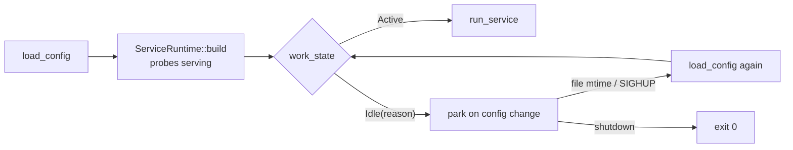

# Lifecycle -- idle until configured

A data-plane app is often deployed before anything has given it work: an
archiver with no archived source, a fetcher with no sources, a transform whose
source has not been written yet. Refusing to boot is the wrong answer -- the pod
crash-loops, and because config is validated before the probe surface exists,
there is not even a `/livez` to explain why.

The idle gate is the other answer: start, stay Ready, open nothing, and pick up
the first config that gives the service work.

---

## The split every app makes

| Config is | Behaviour |
| --- | --- |
| structurally invalid -- bad address, unparseable, contradictory | refuse loudly, exit non-zero |
| valid but EMPTY of work -- no sources, no topics, no destination | idle: start, stay Ready, wait |

The emptiness predicate belongs to the app, because only the app knows what "no
work" means. The behaviour belongs to scalo, so every app idles the same way.

```rust
use scalo::lifecycle::WorkState;

fn work_state(&self, config: &Self::Config) -> WorkState {
    WorkState::idle_if(config.sources.enabled().next().is_none(), "no enabled sources")
}
```

That is the whole app-side change: about ten lines, and `load_config` keeps
refusing a structurally invalid config exactly as before.

---

## Where the gate sits

`run_app` evaluates `work_state` AFTER `ServiceRuntime::build`, so the metrics
server, `/livez` and `/readyz` are already serving before anything can park.
`run_service` is never entered while idle, so the app constructs no transports.



---

## What idle looks like from outside

| Surface | While idle |
| --- | --- |
| `/livez` | 200 |
| `/readyz` | 200 -- the `work_config` component is `Degraded`, which is ready, not healthy |
| `/healthz` | `work_config: degraded`, so an operator can see there is nothing to do |
| `pipeline_idle` | 1 while idle, 0 once work arrives |
| Connections | none -- no broker, no consumer group, no listener socket |

Ready is deliberate: a deploy's readiness gate fails any pod that is not
`n/n Ready`, so an idle app that reported not-ready would fail the deploy it was
meant to survive.

---

## Waking up

The gate parks on [`ConfigWatch`](config.md) -- the same file-mtime poll and
SIGHUP the reloader uses -- re-reads through the app's own `load_config`, and
re-evaluates the predicate. A load that fails while idle is logged and the
previous config kept. Shutdown while idle exits 0 rather than starting work on
the way out.

The poll is 5 s (`lifecycle::IDLE_POLL_INTERVAL`); `kill -HUP` makes it
immediate.

---

## API surface

| Item | Purpose |
| --- | --- |
| `ServiceApp::work_state(&config) -> WorkState` | The app's emptiness predicate; defaults to `Active` |
| `WorkState::{Active, Idle(reason)}` | Whether the config names work |
| `WorkState::idle_if(empty, reason)` | The shape almost every predicate takes |
| `IdleGate` | Gauge + health component + state, held by `run_app` |
| `lifecycle::wait_for_config_change(path) -> GateWake` | The park; returns `ConfigChanged` or `ShuttingDown` |
| `lifecycle::WORK_COMPONENT` | `"work_config"` -- the registered health component |

Feature `lifecycle`, folded into `cli-service`, so no consumer needs a Cargo
edit.

---

## Related

- [health.md](health.md) -- why `Degraded` is ready and `Unhealthy` is not
- [config.md](config.md) -- the cascade and the reloader the gate shares
- [metrics.md](metrics.md) -- `pipeline_idle` beside `pipeline_ready`
- Source: [`src/lifecycle/mod.rs`](../../src/lifecycle/mod.rs)
