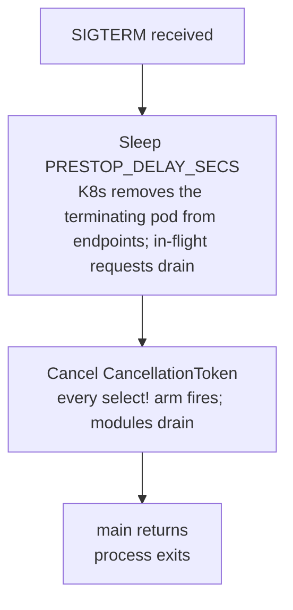

# Shutdown

`shutdown::install_signal_handler()` is called once at startup and returns a
`tokio_util::sync::CancellationToken` that every long-running task clones and
awaits via `token.cancelled().await`. On SIGTERM/SIGINT the handler sleeps for a
K8s pre-stop delay, then cancels the token. All tasks unblock together, drain
in-flight work, and exit; the process exits when `main` returns.

The pre-stop delay keeps traffic off a pod that has stopped accepting work.
Kubernetes takes a terminating pod out of Service endpoints itself, and kube-proxy
picks that up some seconds later. Without the delay the pod drains while traffic
still arrives. With it, the app keeps serving through that window, and only then
does cancellation propagate. Nothing in the shutdown path changes `/readyz` --
see [health.md](health.md).

`ServiceRuntime` from `cli` calls `install_signal_handler` and hands the token to
`run_service`. Consumer services don't construct the token -- they receive it and `select!`
on `token.cancelled()` in every loop.

---

## Pre-stop delay

| Detection | Default | Override |
| --- | --- | --- |
| K8s (via [`env::runtime_context().is_kubernetes()`](../../src/env.rs)) | 5 seconds | `PRESTOP_DELAY_SECS` |
| Docker / bare metal | 0 (immediate cancel) | `PRESTOP_DELAY_SECS` |

Tune `PRESTOP_DELAY_SECS` via a K8s `Deployment` env entry to match the cluster's
kube-proxy endpoint-sync latency. 5 seconds is the safe default.

The delay runs *before* token cancellation:



The shutdown module does signal + delay + cancel and nothing else. Neither it nor
`ServiceRuntime` touches readiness, so `/readyz` answers from the readiness
callback and the health registry throughout. The one flag that does clear is
`HttpServer`'s, when the cancelled token stops it -- see [health.md](health.md).
An app that wants `/readyz` to fail while it drains wires that itself.

When SIGTERM arrives in K8s, the handler increments `pod_eviction_received_total`
(if `metrics` or `otel-metrics` is on) so eviction events are observable.

---

## Module pattern

Every long-running loop should `select!` on `token.cancelled()` as its first arm:

```rust
use scalo::shutdown;
use tokio_util::sync::CancellationToken;

async fn consumer_loop(token: CancellationToken, mut rx: kafka::Consumer) {
    loop {
        tokio::select! {
            biased;                              // shutdown wins ties
            () = token.cancelled() => {
                tracing::info!("draining consumer");
                rx.drain().await;
                break;
            }
            msg = rx.recv() => { if let Some(m) = msg { process(m).await; } }
        }
    }
}
```

`biased` checks shutdown first on every poll -- without it a saturated channel can
starve the cancellation branch. Enforced by code review and the audit script.

For scoped cancellation (cancel a sub-task without shutting down the service), use
`token.child_token()`. Cancelling the parent cancels every child; cancelling a
child leaves the parent running.

---

## Cancel-safety in `select!`

A future polled by `select!` and dropped when another arm wins must be safe to
drop at any await point. Most tokio primitives are; a few are not.

| Future | Cancel-safe? | Notes |
| --- | --- | --- |
| `mpsc::Receiver::recv` | Yes | Drop abandons the wait |
| `oneshot::Receiver` | Yes | |
| `time::sleep` | Yes | |
| `TcpListener::accept` | Yes | |
| `CancellationToken::cancelled` | Yes | |
| `broadcast::Receiver::recv` | **No** | Dropping drops messages -- hoist OUT, `pin!` once, drop only on shutdown |
| `mpsc::Sender::send` after `reserve()` | **No** | Drop loses the permit slot |
| Any state machine you wrote yourself | Usually no | Default to "no" until proven otherwise |

The Kafka offset-commit path in a loader was bitten by this: a
`broadcast::recv` inside `select!` dropped messages on every shutdown event,
corrupting committed offsets. The fix is the `pin!` hoist in
`standards/languages/RUST.md`.

---

## Triggering shutdown programmatically

For tests, integration drivers, or an internal watchdog:

```rust
scalo::shutdown::trigger();        // cancel global token; idempotent
scalo::shutdown::is_shutdown();    // check state without awaiting
```

---

## API surface

| Item | Purpose |
| --- | --- |
| `shutdown::install_signal_handler() -> CancellationToken` | Install SIGTERM/SIGINT handler; spawn the wait task; return the global token |
| `shutdown::token() -> CancellationToken` | Clone the global token (created lazily if no handler installed) |
| `shutdown::trigger()` | Cancel the global token |
| `shutdown::is_shutdown() -> bool` | Check cancellation state without awaiting |
| `CancellationToken::cancelled().await` | The await point every module loop uses |
| `CancellationToken::child_token()` | Scoped cancellation not affecting the parent |

| Var | Effect |
| --- | --- |
| `PRESTOP_DELAY_SECS` | Override pre-stop delay (default 5 in K8s, 0 elsewhere) |

---

## Testing

The global token is process-wide. Tests verifying shutdown behaviour construct a
fresh `CancellationToken::new()` and drive it locally rather than touching the
global -- see `trigger_cancels_token` and
`cancelled_future_resolves_after_cancel` in [`src/shutdown.rs`](../../src/shutdown.rs).

`install_signal_handler` spawns a tokio task; calling it twice is safe (the second
clones the same token; the second listener is inert) but call it once at the top
of `main`.

---

## Related

- [health.md](health.md) -- what `/readyz` answers, which shutdown leaves alone
- [metrics.md](metrics.md) -- `pod_eviction_received_total` on SIGTERM in K8s
- [../runtime/service-runtime.md](../runtime/service-runtime.md) -- `ServiceRuntime` calls `install_signal_handler`
- [../auto-wiring.md](../auto-wiring.md), [../feature-flags.md](../feature-flags.md)
- Source: [`src/shutdown.rs`](../../src/shutdown.rs)
