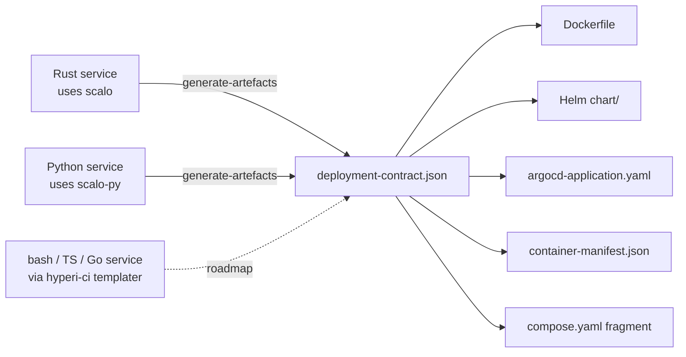

# Contract

`DeploymentContract` is the one struct each service fills in.
From it, scalo derives every deployment artefact -- Dockerfile, Helm
chart, Compose fragment, ArgoCD `Application`, container manifest,
runtime-stage fragment -- with no YAML templates in the app.

Fill in the 20% that's app-specific, get the 80% boilerplate for free.
`validate_*` catches contract-vs-artefact drift in CI.

---

## Why a contract

Hand-maintained Dockerfiles and Helm charts rot: ports added to the
binary but never the chart, healthcheck paths change, new secrets land
in code while the `Secret` template references old key names. The
contract makes the binary the source of truth -- the app declares its
surface, generation produces matching artefacts, validation guards the
boundary.

---

## Schema versioning

`DeploymentContract::schema_version` is checked by CI, giving a
fail-fast hook before generation runs against a stale contract.
Current version is **3** (the field defaults to 3). Bump it when the
struct shape changes in a way that breaks downstream consumers.

| Version | Notes |
|---------|-------|
| 1 | Initial shape -- no `image_profile`, no `oci_labels` |
| 2 | `ImageProfile`, `OciLabels`, `SecretGroupContract` |
| 3 | Current - adds `config_schema` + `capabilities` |

v3 is back-compatible in both directions. Reading FORWARD, a v2 consumer
tolerates a v3 contract because `DeploymentContract` does not set
`deny_unknown_fields`, so serde ignores the fields it does not know -- that
holds whether or not the new fields carry content. Reading BACKWARD, a v3
consumer accepts a v2 contract because both fields carry `#[serde(default)]`.
They are also `skip_serializing_if`, so an app that provides neither emits the
same bytes it did under v2.

---

## Producer tiers



| Tier | Producer | Status |
|------|----------|--------|
| 1 | scalo (this crate) -- Rust services emit the contract from their config struct | **Shipped** |
| 2 | scalo-py -- Python services emit the same contract shape | **Shipped** |
| 3 | hyperi-ci templater -- bash/TS/Go services emit the contract via templating | **Roadmap** |

Tier 3 is aspirational. The contract is JSON-serialisable and
language-neutral by design; the Rust (`scalo`) and Python (`scalo-py`)
producers both exist today. Cross-language consumers read
`deployment-contract.json` (the serialised form), not this crate.

---

## Struct shape

```rust
use scalo::deployment::*;

let contract = DeploymentContract {
    schema_version: 3,
    app_name: "event-loader".into(),
    binary_name: "event-loader".into(),
    description: "Kafka -> ClickHouse data loader".into(),
    metrics_port: 9090,
    health: HealthContract::default(),     // /livez, /readyz, /metrics
    env_prefix: "EVENT_LOADER".into(),
    metric_prefix: "loader".into(),
    config_mount_path: "/etc/event-loader/config.yaml".into(),
    image_registry: image_registry_from_cascade(),   // org registry
    base_image: base_image_from_cascade(),           // org base image
    extra_ports: vec![],
    unbound_listen_paths: vec![],
    entrypoint_args: vec!["--config".into(), "/etc/event-loader/config.yaml".into()],
    secrets: vec![
        SecretGroupContract {
            group_name: "kafka".into(),
            env_vars: vec![
                SecretEnvContract {
                    env_var: "EVENT_LOADER__KAFKA__USERNAME".into(),
                    key_name: "username".into(),
                    secret_key: "kafka-username".into(),
                },
                SecretEnvContract {
                    env_var: "EVENT_LOADER__KAFKA__PASSWORD".into(),
                    key_name: "password".into(),
                    secret_key: "kafka-password".into(),
                },
            ],
        },
    ],
    default_config: None,
    depends_on: vec!["kafka".into(), "clickhouse".into()],
    keda: Some(KedaContract::default()),
    native_deps: NativeDepsContract::for_scalo_features(
        &["transport-kafka", "spool", "tiered-sink"],
        &base_image_from_cascade(),
    ),
    image_profile: ImageProfile::Production,
    oci_labels: OciLabels::default(),
    // v3 fields -- both optional
    config_schema: Some(config_schema_json::<Config>()),
    capabilities: vec![
        Capability::transport("kafka")
            .description("Kafka source and sink")
            .maturity("stable"),
    ],
};
```

### Fields

| Field | Type | Default | Notes |
|-------|------|---------|-------|
| `schema_version` | `u32` | `3` | CI rejects an unsupported version |
| `app_name` | `String` | required | Matches `Chart.yaml` `name`; image repo segment |
| `binary_name` | `String` | `""` -> falls back to `app_name` via `.binary()` |
| `description` | `String` | `""` | Chart description |
| `metrics_port` | `u16` | required | Metrics + health listen port |
| `health` | `HealthContract` | default | Probe paths -- see below |
| `env_prefix` | `String` | required | Config env prefix; `__` is the nesting separator |
| `metric_prefix` | `String` | required | Prometheus namespace |
| `config_mount_path` | `String` | required | E.g. `/etc/event-loader/config.yaml` |
| `image_registry` | `String` | cascade | Container registry base |
| `extra_ports` | `Vec<PortContract>` | `[]` | HTTP / gRPC / data ports beyond metrics -- see [Ports](#ports) |
| `unbound_listen_paths` | `Vec<String>` | `[]` | `default_config` listen paths no port serves -- see [Ports](#ports) |
| `entrypoint_args` | `Vec<String>` | `[]` | Default `CMD` args |
| `secrets` | `Vec<SecretGroupContract>` | `[]` | K8s secret groups |
| `default_config` | `Option<Value>` | `None` | Embedded `values.yaml` `config:` block |
| `depends_on` | `Vec<String>` | `[]` | Compose-only service deps |
| `keda` | `Option<KedaContract>` | `None` | See [keda.md](keda.md) |
| `base_image` | `String` | cascade | Runtime base for the Dockerfile |
| `native_deps` | `NativeDepsContract` | default | See [native-deps.md](native-deps.md) |
| `image_profile` | `ImageProfile` | `Production` | See below |
| `oci_labels` | `OciLabels` | default | Static OCI labels |
| `config_schema` | `Option<Value>` | `None` | JSON Schema of the app's `Config` (v3) |
| `capabilities` | `Vec<Capability>` | `[]` | Runtime-surface catalogue (v3) |

`HealthContract` fields:

| Field | Default | Consumed by |
|-------|---------|-------------|
| `liveness_path` | `/livez` | Dockerfile `HEALTHCHECK`, Helm `livenessProbe` AND `startupProbe` |
| `readiness_path` | `/readyz` | Helm `readinessProbe` |
| `metrics_path` | `/metrics` | Prometheus scrape annotation in `values.yaml` |

Those three paths are the whole probe surface. There are no aliases -- a
retired path returns 404, deliberately, because an alias that keeps answering
200 hides a probe still aimed at the old name.

There is no startup field and no `/startupz`: the `startupProbe` targets
`liveness_path`, since Kubernetes suspends liveness until the startup probe
passes, so one path gives both a generous boot budget and a tight liveness
period without the two drifting apart.

`config_schema` is the JSON Schema (draft 2020-12) of the app's own
`Config`, derived by schemars - `None` when the app does not derive
`JsonSchema`. `capabilities` is the hand-authored catalog of runtime-data
surface schemars cannot see (service names and their knobs); empty when
the app supplies none. Both are also written out as
`config-schema.{json,yaml}` and `capability-catalog.{json,yaml}` by
`emit_config_artifacts`.

The field that bites people is `secrets`: it's `Vec<SecretGroupContract>`,
not flat. Each group bundles env vars sharing one K8s `Secret` (one
Secret per backend -- Kafka credentials, ClickHouse password, Vault
token).

| Field | Purpose |
|-------|---------|
| `group_name` | Section name in `values.yaml`, helper template suffix (`kafkaSecretName`) |
| `env_vars[].env_var` | The full env var name injected into the pod (`EVENT_LOADER__KAFKA__PASSWORD`) |
| `env_vars[].key_name` | Field name in `values.yaml.<group>.secretKeys.<key_name>` |
| `env_vars[].secret_key` | Default K8s Secret data key (`kafka-password`) |

---

## Ports

A port can say when its listener exists, and which listen address it serves.

```rust
extra_ports: vec![
    PortContract::tcp("http", 8080).bound_from("http.listen"),
    PortContract::tcp("push", 6000)
        .when_one_of("config.source.transport", ["direct", "grpc"])
        .bound_from("source.grpc.listen"),
    PortContract::udp("netflow", 2055)
        .when_enabled("config.flow.enabled")
        .bound_from("flow.bind_address"),
],
```

### `when` -- ports that only sometimes listen

A service with two transports binds its push listener on one of them only. Without a gate the port lands in every artefact anyway, so the Service publishes a port that refuses connections.

| Condition | Builder | Holds when the value |
|---|---|---|
| `Enabled { path }` | `.when_enabled(path)` | counts as true -- anything but false, null, zero or empty |
| `Equals { path, value }` | `.when_equals(path, value)` | as a string, equals `value` |
| `OneOf { path, values }` | `.when_one_of(path, values)` | as a string, is one of `values` (for a setting with an alias) |

`path` is a dotted `.Values` path, the same convention as the KEDA trigger's, so app config sits under `config.` -- `config.source.transport`. Each segment must be a Go identifier. A bad segment, or a `one_of` with no values, makes `generate_chart` return `InvalidContract` before it writes anything. A missing or null key reads as off, never as a render error.

Gate `equals` and `one_of` on a string or boolean setting. Both compare the chart's `toString` of the value, and Helm reads a large number in `values.yaml` as a float, so `1000000` in the config prints as `1e+06` and never matches. A numeric gate compares unreliably.

| Artefact | A gated port |
|---|---|
| chart `Deployment` + `Service` | wrapped in `{{- if <condition> }}`, so it renders only when the listener is on |
| Dockerfile + runtime stage | left out of `EXPOSE`, listed in a comment right under it with its condition |
| `container-manifest.json` | left out of `expose_ports`, listed under `conditional_ports` (key present only when a port is gated) |
| compose fragment | published when the condition holds for `default_config`; otherwise a commented-out line to uncomment |
| `unresolved_values_paths()` | reports a gate whose path is absent from `default_config` (null is off, not missing) |

A port without `when` is always on: in every `EXPOSE`, `expose_ports` and published compose port, and in the chart without a condition. A UDP port is written as UDP everywhere -- `514/udp` on `EXPOSE`, in `expose_ports` and on the compose port, since a bare number means TCP -- and the chart writes every protocol upper case (`tcp` renders `TCP`), because Kubernetes takes no other spelling.

### What every port must be

`DeploymentContract::validate()` is the one check the generators that can refuse run first: `generate_chart`, `generate_container_manifest`, `check_chart_drift` and `generate-artefacts` return `InvalidContract` and write nothing when it fails, and `validate_helm_values` reports it. It requires, for each extra port:

- a name Kubernetes takes -- 1 to 15 lowercase letters, digits and single inner hyphens, with at least one letter (`syslog-udp`, not `Syslog_UDP`)
- a protocol of TCP, UDP or SCTP, in any case
- no control character in a `when` path or value, or in `bound_from`

`generate_dockerfile`, `generate_runtime_stage` and `generate_compose_fragment` return text rather than a `Result`, so they cannot refuse. They print a gated port's name and condition onto one comment line with any control character escaped, so a newline in a contract value cannot start a Dockerfile instruction or a YAML key. Run `validate()` in a test to catch the contract itself.

### `bound_from` -- listeners that no port declares

The other direction. `bound_from` names the `default_config` listen address a port serves, as a dotted path relative to `default_config` (`grpc.listen`, not `config.grpc.listen`). `DeploymentContract::undeclared_listeners()` walks `default_config` for listen addresses -- a key named `listen`, `bind_address` or ending `_bind_address` holding a string or null, plus `metrics.address` -- and reports:

- a listen address no port claims
- a `host:port` whose port differs from the port claiming it (`metrics.address` is claimed by `metrics_port`); a null or host-only value is not compared
- a `bound_from` that names nothing in `default_config`

Several ports can claim one address -- three UDP flow ports on one host-only `bind_address` is clean. A client that only sends still has a bind address; list it in `unbound_listen_paths` to waive it. Put the check in a test:

```rust
#[test]
fn every_listener_has_a_port() {
    scalo::deployment::assert_listeners_declared(&deployment_contract());
}
```

`generate-artefacts` runs the same check first and writes nothing while it has a finding.

Neither `bound_from` nor `unbound_listen_paths` changes a byte of any generated artefact.

---

## Dev profile derivation

`ImageProfile::Development` is a one-line variant: same binary, same
linking, plus diagnostic tools (`bash`, `strace`, `tcpdump`, `procps`,
`dnsutils`, `net-tools`, `less`, `jq`) and a `-dev` image tag suffix.

```rust
let prod = build_contract();
let dev  = prod.with_dev_profile();   // ImageProfile::Development

generate_dockerfile(&prod, None);    // base_image + runtime libs only
generate_dockerfile(&dev, None);     // + strace, tcpdump, ...
```

CI produces both: `:1.15.0` (prod) and `:1.15.0-dev` (dev). Operators
pull the dev image into a debug pod for forensic work without
rebuilding.

---

## Cascade-driven defaults

These read from the config cascade so ops can change them org-wide
without rebuilding each app. Wire them into the contract builder to pull
registry and base image from `settings.yaml` rather than baking them into
source.

| Function | Cascade key | Default |
|----------|-------------|---------|
| `image_registry_from_cascade()` | `deployment.image_registry` | `ghcr.io/hyperi-io` |
| `base_image_from_cascade()` | `deployment.base_image` | `debian:trixie-slim@sha256:...` (`DEFAULT_BASE_IMAGE`) |
| `resolve_base_distro(base_image)` | `deployment.base_distro` | derived from `base_image` |
| `argocd_repo_url_from_cascade(app)` | `deployment.argocd.repo_url` | `https://github.com/hyperi-io/<app>` |

The default base image is pinned to its multi-arch index digest, so every build
of one scalo release gets the same bytes. Renovate moves the digest.

Overriding `base_image`? Keep `glibc(runtime) >= glibc(build host)` and
stay off musl (alpine) -- see [native-deps.md](native-deps.md#glibc-keep-runtime--build).
Pin it by digest too, as anything shipped must be. Keep the tag beside the
digest (`image:tag@sha256:...`) so the release still derives, or set
`base_distro` - runtime package names are release-specific and a digest-only
reference carries no codename.

---

## API surface

| Item | Purpose |
|------|---------|
| `DeploymentContract` | Top-level contract struct |
| `DeploymentContract::with_dev_profile()` | Clone with `ImageProfile::Development` |
| `DeploymentContract::to_json()` / `to_yaml()` | Serialise for CI consumption |
| `DeploymentContract::binary()` | Effective binary name (falls back to `app_name`) |
| `DeploymentContract::config_filename()` / `config_dir()` | Split `config_mount_path` |
| `ImageProfile::{Production, Development}` | Profile enum |
| `HealthContract` | `/livez` / `/readyz` / `/metrics` paths |
| `PortContract` | Extra container port beyond `metrics_port`; build with `tcp` / `udp`, gate with `when_*`, link with `bound_from`. A `UDP` protocol (any case) is carried into compose as `"514:514/udp"` and into `EXPOSE` and `expose_ports` as `514/udp`. `generate_chart` refuses a protocol other than TCP, UDP or SCTP (any case) |
| `PortCondition` | When a port's listener exists -- see [Ports](#ports) |
| `DeploymentContract::undeclared_listeners()` / `assert_listeners_declared()` | Listener coverage -- see [Ports](#ports) |
| `SecretGroupContract` | One K8s Secret's worth of env vars |
| `SecretEnvContract` | Single env var sourced from a Secret key |
| `OciLabels` | Static OCI labels (`title`, `description`, `vendor`, `licenses`, `copyright`) |
| `NativeDepsContract` | Runtime APT packages -- see [native-deps.md](native-deps.md) |
| `KedaContract` | Autoscaling thresholds -- see [keda.md](keda.md) |
| `ArgocdConfig` | ArgoCD `Application` repo / path / namespace |
| `DEFAULT_IMAGE_REGISTRY` / `DEFAULT_BASE_IMAGE` | Defaults used when cascade is silent |
| `image_registry_from_cascade()` / `base_image_from_cascade()` / `argocd_repo_url_from_cascade()` | Cascade readers |
| `Capability` / `FieldSpec` | Capability-catalog entry and its config fields |
| `config_schema_json::<T>()` | Derive the JSON Schema for the app's `Config` |

`oci_labels.licenses` and `oci_labels.copyright` do double duty: they set the
OCI labels AND the generated Dockerfile's `# License` / `# Copyright` header,
so a non-Apache consumer does not get scalo's licence stamped into its repo.
Both default to scalo's own values.

---

## CI integration

`<app> generate-artefacts --output-dir ci/` (a `cli`-feature
subcommand) emits the contract. CI then runs `validate_*` to confirm
the repo's chart/Dockerfile still match the contract.

See [artefacts.md](artefacts.md) for what generation writes and
[../integration.md](../integration.md) for the `ServiceApp::deployment_contract`
hook that exposes the contract to the CLI.

---

## Related

- [artefacts.md](artefacts.md) -- what `generate-artefacts` writes
- [native-deps.md](native-deps.md) -- auto-detected APT packages
- [keda.md](keda.md) -- autoscaling contract
- [../auto-wiring.md](../auto-wiring.md) -- singleton pattern
- [../integration.md](../integration.md) -- `ServiceApp` trait
- [../feature-flags.md](../feature-flags.md) -- `deployment`, `cli`
- Source: [../../src/deployment/contract.rs](../../src/deployment/contract.rs)
