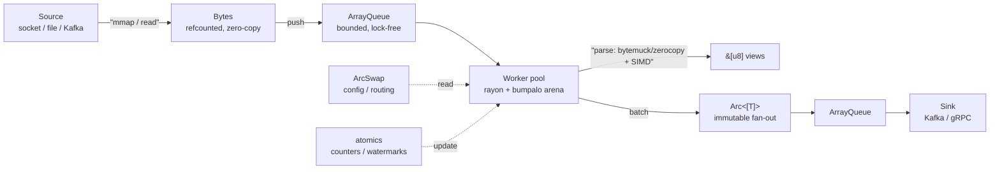
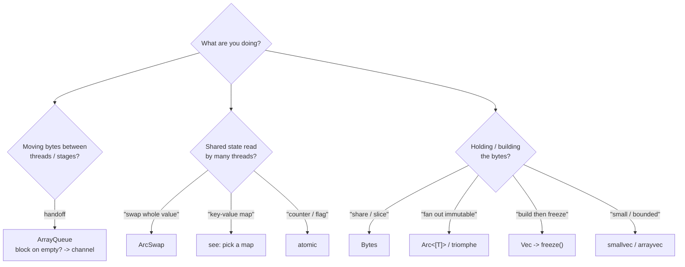

# Rust Memory Structures -- Tier List

Key points for context --
- **Derek's experience with at-scale data processing and ingest.**
- **Perspective:** zero-copy-wherever-feasible - always-multi-threaded - SIMD - batch processing.
- **Hard constraints:** extreme CPU/memory cost-sensitivity ($$$ consumption).
- **Lock-waits are a defect to be avoided**, not a tradeoff to accept.


The workload: **heavily-optimised at-scale data processing**
Zero-copy, multi-threaded, SIMD, PB/hr ingest, where a **1% regression is many
thousands of dollars** in infra or cloud spend, minimum. That's the bar
everything here is judged against -- not *just* "is it fast", but "is it fast enough
that the next 1% is worth the engineering". Grades are opinions. Almost nothing
always wins, so each entry says when to reach for it and when it'll bite.
Versions rot, so I don't pin them -- check crates.io. Anything that stops
being maintained drops to F, full stop -- I'm not betting the data plane on a
dead dep.

---

## Quick pick (in a hurry? start here)

What do you need?

- **A buffer to move / share / slice** -> `Bytes`. Still building it -> `Vec`,
  then `freeze()`.
- **Fan an immutable batch across threads** -> `Arc<[T]>` / `triomphe::Arc`
  (pass `&Arc`, never `.clone()`).
- **A handoff between stages** -> `crossbeam::ArrayQueue`. Block on empty -> a
  channel.
- **Read-mostly state you swap whole** -> `ArcSwap`. Never `RwLock<Arc<T>>`.
- **A concurrent map** -> the map tree below.
- **SIMD on stable** -> `wide` or `pulp`. Not `std::simd`.
- **An allocator** -> jemalloc. (Why an "old" one -> the PGO/BOLT note.)
- **Small / bounded, keep it off the heap** -> `smallvec` / `arrayvec`.
- **A lock** -> first ask if `ArcSwap` or atomics do the job. If you must ->
  `parking_lot`, never std.

The three trees and the table answer most picks. Want the *why* -> the tiers.

### Pick an allocator (all three are S; choose by the job)

```
Need jeprof / MALLOC_CONF heap profiling, or org-policy compliance?  -> jemalloc (tikv-jemallocator)
Target Windows/MSVC, or max portability (wasm/BSD/musl/macOS)?       -> mimalloc
Heavy CROSS-THREAD free (stage A allocs Bytes, stage B frees post-send)? -> snmalloc-rs
Default for a long-running HyperI Linux data-plane binary            -> jemalloc
```

### Pick a concurrent map

```
Read-heavy, lock-free reads, tail-latency-sensitive?         -> papaya  (or scc::HashIndex)
Write-heavy, concurrent inserts, non-blocking resize?        -> scc2::HashMap
Whole table swapped between batches, read-mostly?            -> ArcSwap<HashMap>  (ArcSwap<rpds map> for cheap snapshots)
Want wait-free reads with no reclamation guard?             -> ArcSwap<rpds map>  (left-right family is unmaintained -> F)
Config / cold path, want a drop-in RwLock<HashMap>?          -> DashMap
Genuine in-place mutation, snapshot too costly?              -> shard a parking_lot::RwLock
```

### Pick a SIMD path (stable toolchain)

```
Need runtime CPU dispatch (AVX2 vs AVX-512 vs NEON)?  -> pulp (native width)  or  #[multiversion]
Fixed-width portable, build-time target?             -> wide  (set RUSTFLAGS target-cpu, or build per-target)
Just reinterpreting bytes <-> POD lanes?             -> bytemuck / zerocopy + &[T]
Columnar batch kernels?                              -> arrow-rs compute (verify target-cpu=native for AVX-512 codegen)
On nightly and want std?                             -> std::simd   (NOT available on HyperI stable)
```

### How it flows (where each structure lives on the hot path)



All of it sits on the jemalloc global allocator -- that's the one structure that
touches every box.

### Which structure? (the short version)



### Quick-reference table

| Tier | Item | Tag | Note |
|------|------|-----|------|
| **S** | global allocator (jemalloc/mimalloc/snmalloc) | alloc | one line; jemalloc = org default |
| **S** | `bytes::Bytes`/`BytesMut` | own | align 1 (not SIMD-aligned) |
| **S** | `Arc<[T]>` / `triomphe::Arc` | own | triomphe = no weak count |
| **S** | `ArcSwap` | sync | reads never park |
| **S** | `crossbeam::ArrayQueue` | move | `force_push` = drop-oldest |
| **S** | buffer/object pool | alloc | measure vs tcache before adding |
| **S** | aligned store + `&[T]`/`&mut [T]` | own/view | the zero-copy currency |
| **S** | atomics | sync | weakest correct ordering |
| **S** | Arrow buffers (`arrow-rs`) | own | 64B aligned; set target-cpu |
| **A** | `Box<[T]>` | own | fixed-size single-owner batch |
| **A** | `crossbeam-channel`/`flume` | move | park-on-empty; bounded only |
| **A** | `aligned-vec` (`AVec`/`ABox`) | own | situational (unaligned loads cheap) |
| **A** | `pulp`/`wide` (`std::simd` nightly) | view | std::simd off-limits on stable |
| **A** | `bumpalo`/`typed-arena`/`slab` | alloc | bumpalo not Sync, not aligned |
| **A** | `papaya` | sync | lock-free reads; `pin` guard |
| **A** | `smallvec`/`arrayvec`/`tinyvec`/`heapless` | own | pick by spill/cap/no_std |
| **A** | `MaybeUninit` | own | worth it for large hot buffers |
| **A** | `bytemuck`/`zerocopy` | view | zerocopy for wire/validation |
| **A** | `crossbeam-epoch`/`seize` | sync | seize (hyaline) for read-heavy |
| **A** | `memmap2::Mmap` | view | hazardous on truncation/rotation |
| **A** | `OnceLock`/`LazyLock` | sync | std; ArcSwap if it must reload |
| **B** | `Vec`/`VecDeque` | own | never grow hot; freeze early |
| **B** | `Cow` | own | borrow-until-mutate boundary |
| **B** | `parking_lot` locks | sync | can win at low contention |
| **B** | `scc2::HashMap`/`HashIndex` | sync | scc2 fork; HashIndex = lock-free read |
| **B** | `rpds` | own | cheap snapshots; prefer over `im` |
| **C** | `DashMap` | sync | per-shard RwLock; cold path |
| **C** | `RwLock` (std) | sync | prefer ArcSwap / parking_lot |
| **C** | `Mutex` (std) | sync | prefer parking_lot |
| **C** | `Weak` | own | upgrade() is atomic RMW |
| **D** | `RefCell`/`Cell`/`UnsafeCell` | sync | single-threaded only |
| **D** | `Pin` | own | async plumbing |
| **F** | `Rc`/`Rc<RefCell>` | own | not Send/Sync |

---

## Principles

1. **Never park a thread on the contended hot path.** Anything that can block
   under load -- std `Mutex`/`RwLock`, sharded-lock maps under write contention
   -- is C-tier or worse for the data plane. Lock-free / wait-free or bust.
2. **But lock-free isn't free.** CAS retries, cache-line bouncing, reclamation
   guards (epoch / hyaline / hazard `pin`) all cost. At low contention an
   uncontended `parking_lot::Mutex` (~20-25 ns, spins before it parks) will beat
   a lock-free structure dragging a guard around. What lock-free buys here is
   **tail latency** and **no writer-starves-readers / convoy / priority
   inversion** -- not necessarily mean throughput. Use it where contention or
   tails are the problem, not on reflex.
3. **The allocator is a memory structure.** A per-thread-cache allocator kills
   the lock-waits hiding inside malloc and drops RSS -- straight $$$, one line.
4. **Don't allocate on the hot path -- reuse.** Pools / arenas / `with_capacity`
   turn alloc/free churn into amortised zero.
5. **Don't copy -- share or cast.** Refcounted buffers, slices, `&[u8] <-> &[T]`
   casts move bytes by pointer, not by `memcpy`.
6. **Alignment isn't optional for SIMD -- but matters less than you'd think on
   modern x86.** Nothing in std guarantees >=32B; you provide it or eat
   split-load penalties. But unaligned *loads* are nearly free on Haswell+ --
   alignment's real payoff is dodging cache-line splits and non-temporal stores.
   Profile before you reach for `aligned-vec`/Arrow on the word "alignment"
   alone.

### Tags (what kind of thing it is)

- `[alloc]` -- where bytes come from and how they're recycled.
- `[own]` -- holds the bytes; sole owner or refcounted-shared, no copy.
- `[view]` -- zero-copy borrow or reinterpret of bytes you don't own.
- `[move]` -- hands batches between threads and pipeline stages.
- `[sync]` -- shared state and the primitives that coordinate threads.

### Who parks a thread

- **Never parks:** atomics - `ArcSwap` reads - crossbeam lock-free queues -
  `papaya` reads - per-thread allocator cache - `scc::HashIndex` reads.
- **Parks under contention:** std `Mutex`/`RwLock` - `parking_lot` (after a
  spin) - `DashMap` (per-shard `RwLock`) - `scc::HashMap` (per-bucket RW lock
  under collision). Keep this lot on the control plane only.

---

## S -- reach for these by default

- **Global allocator: jemalloc / mimalloc / snmalloc** -- `[alloc]` -- biggest
  single $$$ lever, one line: `#[global_allocator]`. All three keep per-thread
  caches, so allocator lock contention is near-zero and RSS drops hard.
  - *When to use:* always -- in a BINARY. Every binary gets a global allocator;
    it's the highest-leverage one-liner in the list. A LIBRARY never pins
    `#[global_allocator]` (that's the binary's call) -- it stays
    allocator-agnostic and exposes a heap-source hook (e.g. rustlib's
    `set_heap_source`).
  - *Situational:* jemalloc is the default on a long-lived Linux box -- nothing
    else touches it for heap profiling (`jeprof`, `MALLOC_CONF=prof`) or
    fragmentation control, and it plays straight under PGO/BOLT (see below).
    mimalloc if you're on Windows/MSVC or want the widest portability and lowest
    RSS. snmalloc if your pipeline allocates on one thread and frees on another
    -- its [message-passing design](https://github.com/microsoft/snmalloc) makes
    the remote free lock-free, which is exactly our shape. Don't bake-off per
    project. Policy is jemalloc.

- **`bytes::Bytes` / `BytesMut`** -- `[own]` -- zero-copy refcounted buffers; O(1)
  slice/split; `freeze()` is free -> `Send + Sync`. `Bytes::from_owner` wraps
  anything `AsRef<[u8]>` (an mmap, say) with no copy.
  - *When to use:* your default buffer. Anything that crosses a thread or gets
    sliced/split -- transport, network, fanning a payload out to N consumers.
  - *Situational:* no good for SIMD compute -- you're guaranteed 1-byte alignment
    and get whatever the allocator's size class hands you, never 32/64B. Need
    aligned loads? Carve the middle with `slice::align_to` and wear the scalar
    tail, or reach for `aligned-vec`/Arrow. `Bytes` to share, `Vec` to build,
    `Box<[T]>` when there's one owner and no slicing.

- **`Arc<[T]>` / `triomphe::Arc`** -- `[own]` -- fan an immutable batch out across
  threads, no copy.
  - *When to use:* hand the same immutable batch to a pile of threads/tasks
    without copying it.
  - *Situational:* use `triomphe` on hot paths -- no weak count, smaller header,
    no poisoning, and `ArcBorrow` is just `&T` so you skip the pointer chase.
    Pass `&Arc`, never `.clone()`, in a tight loop or you'll bounce the refcount
    cache line across cores. Back to `std::sync::Arc` only when you need `Weak`.

- **`ArcSwap<T>`** -- `[sync]` -- the `RwLock<Arc<T>>` killer; reads never park.
  - *When to use:* read-mostly state you swap whole -- config, routing/dispatch
    tables, schemas.
  - *Situational:* built for "write once in a blue moon, read flat out". Reads
    are lock-free and [mostly wait-free](https://docs.rs/arc-swap/latest/arc_swap/docs/performance/index.html).
    Writes are the dear part, so it falls over if you write hot, or if readers
    sit on a `Guard` -- the next writer promotes every live guard and now
    everyone's fighting over the refcount. `ArcSwap::cache` for the hottest
    readers. Beats `RwLock<Arc<T>>` every time.

- **`crossbeam::queue::ArrayQueue`** -- `[move]` -- bounded MPMC lock-free ring;
  push `Bytes`/`Arc<Batch>`, no per-op alloc.
  - *When to use:* the lock-free handoff between pipeline stages -- the SYNC
    one. In an async pipeline the handoff is a bounded `tokio::mpsc` instead
    (parks the task, not the thread); same job.
  - *Situational:* `force_push` drops the oldest when full -- shed-oldest
    backpressure for free, which is the inbound-gate doctrine to a tee. Want
    consumers to block on empty? That's a channel. Want unbounded? That's an OOM
    with extra steps -- don't.

- **Buffer / object pool (reuse)** -- `[alloc]` -- recycle batch buffers; back the
  free-list with a lock-free queue (`ArrayQueue`).
  - *When to use:* high-churn paths where the buffers are much of a muchness --
    get, clear, return, repeat.
  - *Situational:* kills alloc/free churn and RSS spikes. But if your sizes are
    all over the shop the pool fragments and squats on peak-size buffers --
    steady-state RSS gets worse, not better. And a good tcache allocator might
    already make the alloc cheap enough that the pool earns nothing. Measure
    first.

- **Aligned backing store + `&[T]` / `&mut [T]`** -- `[own/view]` -- slices are
  the actual zero-copy currency; back them with `#[repr(align(64))]` or
  `aligned-vec` and hand out per-batch windows.
  - *When to use:* always -- it's the unit of work you pass between functions and
    stages.
  - *Situational:* the only question is whether the *backing* store needs
    explicit alignment, and on modern x86 it usually doesn't (principle 6).
    Profile before you reach for `aligned-vec`/Arrow on "alignment" alone.

- **Atomics (`AtomicU64`, `AtomicPtr`, ...)** -- `[sync]` -- watermarks, sequence
  numbers, counters, flags. Never parks.
  - *When to use:* any single-word counter, flag, watermark or pointer. Reach
    here before you reach for a lock.
  - *Situational:* take the weakest ordering that's correct -- `Relaxed` for
    stats, `Release`/`Acquire` for a flag that guards data, `SeqCst` almost
    never. A bag of atomics is not a transaction -- two words that change
    together need a lock or a real lock-free structure.

- **Apache Arrow buffers (`arrow-rs`)** -- `[own]` -- 64B-aligned, refcounted,
  zero-copy IPC/FFI; not tied to the global allocator nor u8 alignment.
  - *When to use:* columnar batch data, and anything that crosses a language
    boundary or goes out over IPC.
  - *Situational:* brilliant for columnar + compute kernels + interop, dead
    weight for row-shaped or tiny records. Mind the trap: 64B-aligned buffers
    don't mean AVX-512 codegen -- arrow-rs leans on LLVM autovectorisation and
    the x86_64 defaults play it safe, so set `target-cpu=native` or you're
    leaving the wide instructions on the table. And Derek likes
    [Wes](https://wesmckinney.com/).

## A -- strong, situational

- **`Box<[T]>`** -- `[own]` -- fixed-size batch, no capacity word, falls straight
  into `Arc<[T]>`. (Plain `Box<T>` is just plumbing.)
  - *When to use:* a finished batch of known size with a single owner.
  - *Situational:* lighter than `Vec` and converts to `Arc<[T]>` free. Still need
    to grow? Stay on `Vec` until you freeze.

- **`crossbeam-channel` / `flume`** -- `[move]` -- MPMC channels for decoupling
  stages; consumers block on empty.
  - *When to use:* decoupling stages where the consumer should block on empty,
    bounded for backpressure.
  - *Situational:* `flume` is leaner with `Sync` senders and async, but it's in
    casual maintenance; `crossbeam-channel` is worked on more actively and has
    `select`. Either loses the very hottest handoff to `ArrayQueue`. Bounded,
    always -- unbounded is OOM with extra steps.

- **`aligned-vec` (`AVec` / `ABox`)** -- `[own]` -- guaranteed 32/64B alignment
  for AVX2/AVX-512 aligned loads/stores. The bit most lists forget.
  - *When to use:* you actually need aligned stores, non-temporal stores, or to
    dodge cache-line splits on a hot kernel.
  - *Situational:* unaligned loads are nearly free on Haswell+, so don't reach
    for it on reflex. Plain aligned buffer -> `aligned-vec`; columnar + IPC ->
    Arrow.

- **`pulp` / `wide` (`std::simd` is nightly-only)** -- `[view]` -- the
  batch-compute primitive itself.
  - *When to use (stable):* `wide` for fixed-width portable SIMD pinned at build
    time; `pulp` when one binary has to pick AVX2 vs AVX-512 vs NEON at runtime.
  - *Situational:* [`std::simd` is still nightly](https://shnatsel.medium.com/the-state-of-simd-in-rust-in-2025-32c263e5f53d),
    so it's off the table for us. `wide` is simple but build-time only -- compile
    per target or `target-cpu=native`. `pulp` does runtime dispatch (it's what
    `faer` runs on) but only at native width, so your code copes with
    variable-width chunks, and generic over `f32`/`f64` is a pain. `fearless_simd`
    is the up-and-comer.

- **`bumpalo` / `typed-arena` / `slab`** -- `[alloc]` -- allocate-many/free-all
  per batch (`bumpalo`), single-type arena (`typed-arena`), stable-index slot
  storage (`slab`).
  - *When to use:* `bumpalo` for a heap of short-lived allocations with the same
    lifetime you bin in one `reset()`; `slab` for stable integer handles;
    `typed-arena` for one type with interior references.
  - *Situational:* `bumpalo` isn't `Sync` (no concurrent alloc) and isn't
    SIMD-aligned. Big win on alloc-heavy passes.

- **`papaya`** -- `[sync]` -- lock-free-read concurrent hashmap; no reader
  lock-waits, predictable tails. The DashMap replacement under our constraint.
  - *When to use:* a read-heavy map where reads must be lock-free and you care
    about tail latency.
  - *Situational:* reads sit behind a [reclamation guard](https://ibraheem.ca/posts/designing-papaya/)
    -- reuse the `pin`, it costs about an uncontended mutex. Every entry's a heap
    allocation, so mind the memory. Same niche as `scc::HashIndex`; pick it over
    DashMap whenever tails matter -- but NOT when the DashMap is read-only after
    warmup; then the `pin` guard costs about the same as an uncontended shard
    read and you'd add a dep for nothing.

- **`smallvec` / `arrayvec` / `tinyvec` / `heapless`** -- `[own]` -- small/bounded
  batches on the stack -> zero heap -> $$$ + cache wins.
  - *When to use:* small/bounded collections you want to keep on the stack.
  - *Situational:* `smallvec` spills to the heap on overflow; `arrayvec`
    hard-caps and never touches the heap (push errors or panics); `tinyvec` is
    all-safe but wants `Default`; `heapless` for `no_std`/fixed. Once it's
    genuinely big it's a `Vec` again -- don't blow the stack.

- **`MaybeUninit<T>` / `Box<[MaybeUninit<T>]>`** -- `[own]` -- fill via SIMD/DMA
  without zeroing first; skips a whole pass over memory.
  - *When to use:* filling a big buffer via SIMD or DMA and you don't want to
    zero it first for nothing.
  - *Situational:* worth it on large hot buffers (>~4KB) where the
    zero-then-overwrite double pass shows in a profile. On small buffers it's not
    worth the `assume_init` footgun -- the zeroing's already in cache.

- **`bytemuck` / `zerocopy`** -- `[view]` -- safe reinterpret of `&[u8] <-> &[T]`
  (POD), no copy. The core of zero-copy parse -> SIMD lanes.
  - *When to use:* `bytemuck` for trusted, same-endian, in-memory POD casts;
    `zerocopy` the moment the bytes are untrusted, unaligned, or off the wire.
  - *Situational:* `bytemuck`'s lighter (no derive for primitives). `zerocopy`
    validates (`TryFromBytes`), pins down layout (`KnownLayout`/`Immutable`),
    checks alignment, and its `byteorder` module sorts endianness -- which a
    plain cast never will. Wire format -> zerocopy, no argument.

- **`crossbeam-epoch` / `seize` / hazard pointers** -- `[sync]` -- safe memory
  reclamation when you build your own lock-free structures.
  - *When to use:* rolling your own lock-free structure and you need to free
    memory safely.
  - *Situational:* [`seize`](https://github.com/ibraheemdev/seize) (hyaline)
    spreads reclamation across threads, so it beats
    [epoch](https://docs.rs/crossbeam/latest/crossbeam/epoch/index.html) for
    read-heavy work -- crossbeam-epoch makes readers check garbage every 128 ops
    and your tails pay for it.
    [Hazard pointers](https://en.wikipedia.org/wiki/Hazard_pointer) bound the
    memory but cost more per access. Honestly: don't roll your own. Use
    `papaya`/`scc2`.

- **`memmap2::Mmap` + `Bytes::from_owner`** -- `[view]` -- zero-copy ingest of
  large on-disk/shared inputs straight into a `Bytes` view.
  - *When to use:* zero-copy ingest of a big, sequential, on-disk file you
    control.
  - *Situational:* `memmap2`, not `memmap` (that one's dead). Nasty for random
    small reads (page-fault storms) and lethal if the file's truncated or
    rotated under you -- mapping past EOF is UB, which is the log-tailing trap
    exactly. Tailing wants buffered reads with rotation checks, not mmap.

- **`OnceLock` / `LazyLock`** -- `[sync]` -- init shared immutable state once,
  read with no lock after. In std now.
  - *When to use:* set-once immutable state -- a compiled regex/CEL, a static
    table, an HTTP client.
  - *Situational:* `LazyLock` for lazy-on-first-touch, `OnceLock` when you own
    the init point. Drop `once_cell`. Needs to reload at runtime? Wrong tool --
    that's `ArcSwap`.

## B -- useful with discipline

- **`Vec<T>` / `VecDeque<T>`** -- `[own]` -- the contiguous workhorse / ring, but
  growth reallocs+copies (kills zero-copy) and is default-aligned.
  - *When to use:* the buffer you build in -- `with_capacity` once, fill, then
    `freeze()` into `Bytes` or hand off as `Arc<[T]>`.
  - *Situational:* the second it grows in a hot loop you've eaten a realloc, a
    memcpy, and invalidated every slice into it. `VecDeque` for a plain
    single-threaded ring; cross-thread it's `ArrayQueue`.

- **`Cow<'a, [T]>`** -- `[own]` -- borrow until you have to mutate. On-brand for
  zero-copy at API boundaries.
  - *When to use:* API boundaries where most inputs sail through untouched and
    only the odd one needs an owned, mutated copy.
  - *Situational:* if you end up mutating nearly every time, drop the pretence
    and just own it.

- **`parking_lot::{Mutex, RwLock}`** -- `[sync]` -- if you *must* lock: smaller,
  faster uncontended, no poisoning.
  - *When to use:* when you genuinely have to lock -- control plane, or a warm
    path that isn't really contended.
  - *Situational:* uncontended ~20-25 ns (spins before it parks); per principle 2
    it can even pip a lock-free structure at low contention. Under real
    contention it parks, and never hold it across `.await`
    (`clippy::await_holding_lock`). A better `Mutex`/`RwLock` than std, full
    stop.

- **`scc2::HashMap` / `scc2::HashIndex`** -- `[sync]` -- lock-free non-blocking
  resize, bucket-granular locks; best of the lock-based maps for write-heavy.
  - *When to use:* write-heavy maps that need non-blocking resize (`HashMap`);
    lock-free reads (`HashIndex`).
  - *Situational:* use the `scc2` fork -- upstream `scc` is parked. `HashMap`
    reads sit behind a per-bucket RW lock, so reads that must be lock-free use
    `HashIndex`. No container-level lock, so contention drops as it grows.

- **`rpds` persistent structures** -- `[own]` -- structural sharing buys cheap
  snapshots, but it's allocation-heavy (node churn).
  - *When to use:* versioned config or state where you want O(1) snapshots and
    copy-on-write without cloning the whole thing.
  - *Situational:* pairs a treat with `ArcSwap` -- cheap snapshots, none of
    left-right's 2x copy. Reach for `rpds`, not `im` (im's effectively dead).
    Point ops are slower and the node churn is real $$$ -- keep it off the
    per-record path.

## C -- control-plane only (lock-waits -- keep off the hot path)

- **`DashMap`** -- `[sync]` -- per-shard `RwLock`; a writer blocks its shard's
  readers, a slow writer spikes that shard's read latency.
  - *When to use:* a no-thought `RwLock<HashMap>` drop-in on config/cold paths
    -- OR a hot-path map that's READ-ONLY after warmup (pre-populated, no
    writers, e.g. a field interner): the shard read-locks never contend, so it's
    fine where the tier would otherwise say no.
  - *Situational:* a hot key turns one shard into a queue, and it'll deadlock if
    you call it while holding any reference into the map. Off the hot path
    UNLESS it's read-only after warmup (then shard reads never contend). Hot
    reads WITH writers -> `papaya`; write-heavy -> `scc2`.

- **`RwLock` (std)** -- `[sync]` -- readers bounce a shared reader-count atomic,
  plus writer starvation, plus poisoning.
  - *When to use:* genuine in-place mutation where snapshotting really is too
    dear.
  - *Situational:* read-mostly? `ArcSwap`. Have to lock? `parking_lot`. Near a
    hot path? Shard it.

- **`Mutex` (std)** -- `[sync]` -- fine for the odd control-plane swap; suspect
  inside any SIMD batch loop.
  - *When to use:* one-off init or a rare control-plane mutation.
  - *Situational:* `parking_lot::Mutex` beats it nearly always (no poisoning, a
    touch faster). Inside a batch loop it's a smell.

- **`Weak<T>`** -- `[own]` -- cycle breaking / evictable caches; not a hot-path
  structure.
  - *When to use:* breaking cycles, or caches that mustn't pin their entries
    alive.
  - *Situational:* `upgrade()` is an atomic RMW and drags you back to
    `std::sync::Arc` (triomphe has no weak count). Not a hot-path tool.

## D -- disqualified for this workload

- **`RefCell` / `Cell` / `UnsafeCell`** -- `[sync]` -- single-threaded; `!Sync`.
  `UnsafeCell` is what you *build* lock-free structures on, not something you
  wave around.
  - *When to use:* single-threaded interior mutability only -- e.g. a
    `Cell<usize>` cursor advancing under `&self` (the clickhouse-rs fork does
    exactly this).
  - *Situational:* fine inside one thread or one rayon task, nowhere near a
    shared one.

- **`Pin<T>`** -- `[own]` -- async / self-referential plumbing.
  - *When to use:* reusable `Pin<Box<Sleep>>` timers, hand-rolled `Future`/
    `Stream` state machines.
  - *Situational:* nothing to do with batch memory -- it's here so you don't file
    it under "memory structure" by mistake.

## F -- don't

**Won't compile here**

- **`Rc` / `Rc<RefCell<T>>`** -- `[own]` -- not `Send`/`Sync`. "Always
  multi-threaded" deletes these outright. Legal and a hair faster than `Arc`
  inside a single thread (non-atomic refcount), but it can't cross the
  boundaries that matter. F, and it stays F.

**Not being maintained** -- at this scale you can't bet the data plane on a dead
dep; a 1% regression you can't get a fix for is real money. Doesn't matter how
good the design is -- if it's not maintained, it's F.

- **`im`** -- not being maintained. Use `rpds`.
- **`memmap`** -- not being maintained. Use `memmap2`.
- **`scc` (original)** -- not being maintained (archived). Use the `scc2` fork.
- **left-right / `evmap` / `flashmap`** -- only passively maintained; for
  wait-free reads on a read-mostly table use `ArcSwap` + `rpds` instead.

---

## Not all of these are equal under PGO/BOLT (hyperi-ci stage 2)

On the release channel, hyperi-ci stage 2 rebuilds the binary with PGO and runs
[BOLT](https://github.com/llvm/llvm-project/tree/main/bolt) over it --
profile-guided branch layout, hot/cold splitting, icache packing, 15-35% on top
of fat LTO. That changes which structures pay off, because PGO/BOLT only help
where the profile is **stable** and the hot path is **clean**:

- **Stable hot paths optimise; twitchy ones don't.** A lock-free queue, an
  ArcSwap read, a jemalloc tcache hit -- same path every time, so the profiler
  nails it and BOLT packs it tight. A contended lock or a fragmenting allocator
  takes a different path every run; the profile is noise and BOLT can't help.
  One more reason lock-waits and fragmentation are defects, not trade-offs.
- **Keep hot and cold split.** Mark lazy-init and error paths
  `#[cold] #[inline(never)]` so PGO/BOLT pull them out of the hot icache (pool
  fast-path vs slow alloc, parse fast-path vs fallback). Structures with a clean
  fast/slow split optimise far better than branchy ones.
- **This is why jemalloc, "old" as it is.** We don't run jemalloc because it
  wins a microbenchmark this week -- snmalloc or mimalloc might. We run it
  because it's predictable: the same allocation behaviour run to run (so the PGO
  profile is representative), `jeprof` to actually SEE the hot allocations, and
  the whole DFE build/profile story is built around it. Under PGO/BOLT an old
  allocator with a stable profile and real tooling beats a newer one that's
  faster-but-twitchy and hands you a noisy profile. Predictable > novel.
- **Lower channels don't get this.** PGO/BOLT are release-only (and opt-in). On
  spike/alpha/beta you're on thin/fat LTO with no profile rewrite, so pick for
  raw behaviour -- the profile-stability bonus only lands at release.

Cross-ref: hyperi-ci channel-tiered build (stage 2), `RUST.md` -- Release-Track
Build Optimisation.

## Maintenance (check crates.io before you depend on it)

The dead ones are in F. These are still alive but worth a glance:

- **`flume`** -- casual maintenance (bug/security only); `crossbeam-channel` is
  the livelier sibling.
- **`std::simd`** -- nightly-only and staying that way; build on `wide` / `pulp`.

---

## Appendix: agent review pass (`/review-rust-memory`)

This bit's for the coding agent, not you -- skip it.

Point an agent at this doc to review memory-structure choices in HyperI Rust and
recommend swaps. Wire it as a Claude Code skill (`/review-rust-memory`) or run it
ad hoc -- the doc is the rubric, the agent does the legwork.

**Trigger.** Reviewing hot-path / data-plane Rust; a PR touching buffers, maps,
locks, channels, allocators or SIMD; or anyone asking "is this the right
structure here?".

**Steps.**

1. **Find the hot path first.** Tier calls only matter there -- control-plane
   code gets a pass. Use "who parks a thread" and the six principles as the lens.
2. **Flag the usual sins:** std `Mutex`/`RwLock` or `DashMap` on the hot path;
   `Arc::clone` in a tight loop instead of `&Arc`; a `Vec` that grows in the
   loop; `Rc`/`RefCell` anywhere shared; no global allocator set on a binary;
   `regex`/`glob` on the hot path (cross-ref the Rust standards); unbounded
   channels; a lock held across `.await`; `im`/`scc`/`memmap` where the live
   successor (`rpds`/`scc2`/`memmap2`) is the call.
3. **Name the tier-appropriate swap with the `When to use:` reason** -- not
   "lock-free is always better". Respect principle 2: at low contention an
   uncontended `parking_lot` lock can be the right answer. Don't cargo-cult.
4. **Re-verify crate health before recommending** -- versions and maintenance
   rot, and this doc pins none on purpose. Web-search current state (the `/deps`
   rules). If a recommended crate has gone the way of `scc`/`im`, point at the
   live fork/successor.
5. **Don't churn for churn's sake.** A B-tier structure that's correct and off
   the hot path stays. Recommend a change only when it buys real CPU, memory, or
   tail-latency, or removes a lock-wait. Under PGO/BOLT release builds, also
   prefer structures with a stable hot path and clean fast/slow split.

**Output.** Per finding: `file:line`, current choice -> recommended, the tier +
a one-line why, and a rough effort. Group hot-path-critical vs nice-to-have. No
diff unless asked.

**Guardrails.** Advisory only -- don't rewrite without a yes. Allocator policy is
jemalloc; don't "recommend" mimalloc/snmalloc unless the situational call
(Windows, cross-thread free) actually applies. SIMD recommendations stay on the
stable toolchain -- no `std::simd`. If the existing choice is already right, say
so and move on.

**Field notes (from running this on hyperi-rustlib).** A clean codebase yields a
SHORT report -- "conforms, no change" is a valid, valuable result; never
manufacture remediation to justify a release. Three refinements came out of that
pass: (1) a library never sets `#[global_allocator]` -- only flag a missing
allocator in a BINARY; a lib exposes a heap-source hook. (2) A bounded
`tokio::mpsc` IS the async ArrayQueue -- don't flag "no ArrayQueue" in an async
pipeline. (3) DashMap on a hot path is fine if it's read-only after warmup --
check for writers before recommending papaya.
