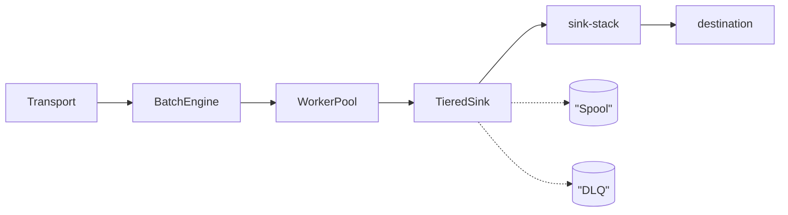

# Pipeline

The hot path: what happens to a batch between arriving on a transport and
landing at its destination. Everything here is opt-in behind a feature flag --
a service takes only the stages it needs.

The through-line is that no stage drops data silently. A stage that cannot keep
up applies backpressure upstream, and a stage that fails hands off to the next
fallback (buffer, then disk, then DLQ) rather than discarding.

Solid arrows are the happy path; dotted are the fallbacks that only carry data
when the happy path is failing.

| Doc | Covers |
| --- | --- |
| [batch-engine.md](batch-engine.md) | SIMD parse, pre-route filter, field interning |
| [worker-pool.md](worker-pool.md) | `AdaptiveWorkerPool`, pressure-based scaling |
| [tiered-sink.md](tiered-sink.md) | resilient delivery, disk spillover, circuit breaker |
| [sink-stack.md](sink-stack.md) | timeout / load-shed / concurrency / retry / rate-limit |
| [spool.md](spool.md) | disk-backed async FIFO |
| [dlq.md](dlq.md) | file, Kafka and HTTP backends |
| [strmatch.md](strmatch.md) | 4-tier regex to fast-path matcher |
| [scaling.md](scaling.md) | `ScalingPressure`, KEDA external scaler signal |

For why the pipeline throttles the way it does, read
[../backpressure.md](../backpressure.md) first.
