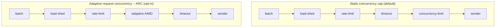
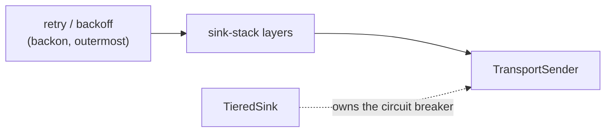

# Sink-stack (outbound control stack)

`sink-stack` wraps any `TransportSender` so every outbound sink gets timeout,
concurrency limiting, load-shedding, rate-limiting and retry/backoff for free,
without each sink re-deriving them. It is opt-in (`sink-stack` feature) and
every knob defaults to behaviour-preserving values, so wrapping a sender with
the default config changes nothing until you turn a control on.

The controls are not independent: their **order** is load-bearing, and it
differs between the two concurrency modes. Read the order off the diagrams
rather than the prose.

## Layer order

Composed with tower's `ServiceBuilder` (outer -> inner). An attempt enters at
the left and the bytes leave at `sender`.

The difference that bites: under the static cap the **timeout wraps the
concurrency gate** (a request waiting for a slot can still time out). Under ARC
the **adaptive limiter wraps the timeout**, so a timed-out or errored attempt
feeds the AIMD decrease and a fast success feeds the increase -- the limiter
learns the downstream's safe concurrency from RTT and error feedback.

ARC's `min_limit` floors at 1, so a failing sink can never deadlock the limiter
at zero. It is the OUTBOUND limiter only, kept distinct from the inbound
worker-pool AIMD so the two never double-regulate. Caveat: when saturated the
limiter backpressures (it never drops) but its readiness check busy-polls at the
limit -- pair ARC with `load_shed` or a non-zero `min_limit` headroom for
sustained-overload deployments.

## Retry and the circuit breaker live outside the stack

Retry/backoff wraps the whole composed service as the OUTERMOST control (driven
by `backon`), so each retry re-enters at `load-shed` and every attempt is
independently timeout-bounded. Circuit-breaking is deliberately NOT a layer
here: the `TieredSink` already wraps its sink in its own breaker, and a second
one would double-regulate.

## Delivery guarantee (at-least-once preserved)

- Rate-limit and concurrency-limit only DELAY admission; they never drop.
- Retry re-sends the WHOLE batch on a transient failure. Records are held behind
  an `Arc`, so a retry is a refcount bump, not a copy.
- A fatal error stops immediately -- no point retrying a permanent failure.
- The call returns a `SendResult`; the caller fires its commit tokens only on
  `SendResult::Ok`, exactly as for a bare `send_batch`. Retries may re-deliver a
  partially-sent prefix (at-least-once: duplicates, never loss) -- identical to
  the transport's own `send_batch` contract.

## Configuration

Loaded from the cascade under `sink_stack` (`SinkStackConfig::from_cascade`), or
an explicit key via `from_cascade_key`. Defaults preserve behaviour: no
concurrency cap, ARC off, queue-don't-shed.

| Key | Default | Meaning |
|-----|---------|---------|
| `max_concurrency` | `0` | Static in-flight cap; `0` = uncapped. Ignored when `adaptive` is set |
| `adaptive` | unset | Enables ARC (AIMD limiter), replacing the static gate |
| `attempt_timeout_ms` | `30000` | Per-attempt timeout |
| `load_shed` | `false` | Shed (fail-fast) instead of queueing when the inner service is not ready |
| `max_retries` | `3` | Retry attempts on transient failure |
| `min_backoff_ms` | `100` | Exponential backoff floor |
| `max_backoff_ms` | `30000` | Exponential backoff ceiling |
| `rate_limit` | off | Token-bucket admission rate (see `RateLimitConfig`) |

ARC sub-knobs (`adaptive`): `initial_limit` (`10`), `min_limit` (`1`),
`max_limit` (`100`), `increase_by` (`1`), `decrease_factor` (`0.5`).

See also [TIERED-SINK.md](TIERED-SINK.md) for the breaker/spool/DLQ delivery
path that sits around the sender, and [../SELF-REGULATION.md](../SELF-REGULATION.md)
for the inbound side that the outbound ARC is kept separate from.
