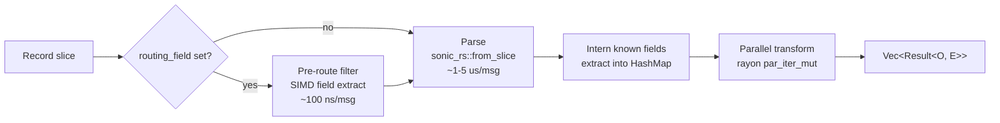

# Batch Engine

SIMD-optimised batch processor for data-plane mid-tier pipelines. Parses JSON
via `sonic-rs`, applies pre-route filters before parsing where it can,
interns known field names via `dashmap`, and runs the user transform
across a rayon pool. Auto-wired by `ServiceRuntime` when the
`worker-batch` feature is on.

`BatchEngine` is the standard ingest-loop primitive for loader,
archiver, and transform apps -- it sits between a `TransportReceiver`
and an app-supplied sink.

---

## Two modes

| API | Parses? | Transform receives | Use case |
| ----- | --------- | -------------------- | ---------- |
| `process_mid_tier` | Yes (SIMD JSON) | `&mut ParsedMessage` | Loader, archiver, VRL -- needs field access |
| `process_raw` | No | `&Record` | Receiver forwarding, binary protocols, opaque payloads |

Both take a `&[Record]` slice, chunk it at `max_chunk_size` (default
10 000), and call the transform across a rayon pool.

---

## Pipeline phases (mid-tier)



Filter-rejected messages are removed from the output. DLQ-routed and
parse-error messages become `Err` entries; the action is configured
via `parse_error_action: dlq | skip | fail_batch`.

`process_raw` skips the parse and intern phases -- pre-route runs on
raw bytes only.

---

## Field interning

`FieldInterner` deduplicates field-name strings via
`DashMap<Arc<str>, ()>`. Pre-populated at construction with the
configured `known_fields` (`_table`, `_timestamp`, `_source`, `host`,
`source_type`, `event_type` by default). Hot-path costs:

| Path | Cost |
| ------ | ------ |
| Already interned (`Arc::clone`) | ~20 ns |
| First occurrence (`Arc::from` + insert) | ~100 ns |

Once a field is interned, every subsequent batch reuses the same
`Arc<str>` -- the slow path runs at most once per unique field per
process. `ParsedMessage::field()` checks the extracted map first
(interned fast path) before walking the full JSON tree.

See [`../../src/worker/engine/intern.rs`](../../src/worker/engine/intern.rs).

---

## Run loops

Four async methods drive the engine from a `TransportReceiver`, one
`WorkBatch` at a time: `recv`, route inline DLQ entries, `process`, the
sink, then the commit. They need the `transport` feature.

| Method | `process` receives | The sink gets | Use |
| -------- | -------------------- | --------------- | ----- |
| `run_governed` | `WorkBatch` | Byte-budget sub-blocks with the governor on, the whole block with it off | The default for a self-regulating app |
| `run_workbatch` | `WorkBatch` | The whole block | On-demand parse: a transform calls `codec::parse` when it needs a field |
| `run_workbatch_parsed` | `ParsedBatch` (records, parsed payloads, `FieldInterner`) | The whole block | The driver pre-parses the block on the pool |
| `run_workbatch_streaming` | `WorkBatch` | Sub-blocks of a caller-supplied byte size | Peak memory bounded to one sub-block |

`process` must keep the block's `commit_tokens` (`WorkBatch::map_records`
does). `CommitMode::Auto` has the engine commit them once the sink takes
the block; `CommitMode::SinkManaged` leaves the commit to the sink, which
lets it defer until a downstream write lands. The sub-block paths take
`Auto` only. The optional ticker fires inside the loop's `biased`
`select!`, after the shutdown arm.

A `recv` or sink failure that is `Backpressure` or `Timeout` is retried
after a jittered backoff, 100 ms doubling to 2 s. The refused block is
held, and nothing later is fetched or committed past it. Any other
failure stops the loop with the block uncommitted.

### Shutdown

When the shutdown token fires, the loop closes the source and runs every
block it still returns through `process`, the sink and the commit until
`recv` reports `TransportError::Closed`. A push source such as the gRPC
or HTTP server acknowledges a record once it is queued, so a loop that
stopped at the token lost what the source had acknowledged.

- Kafka, file and pipe sources report `Closed` as soon as they are
  closed, so the drain reads nothing more. Kafka re-delivers what was not
  committed after a restart.
- A block the sink refuses transiently (`Backpressure`, `Timeout`) is
  retried with the usual backoff for up to 10 s after the loop sees
  shutdown, whether the sink began refusing before shutdown or during the
  drain. A sink busy for a moment at shutdown therefore loses nothing.
- A block the sink still refuses when those 10 s are up stays uncommitted,
  and the drain stops there, so nothing is committed past it. What the
  source still holds is not delivered. If the sink was refusing it before
  the drain began, the source is closed without a drain.
- A permanent sink error stops the drain at once and is returned as the
  run's error, as it is before shutdown.
- A source that returns nothing for 5 s without reporting `Closed` ends
  the drain.

The source is closed when the method returns, so the app's own final
flush comes after it. Source: [`driver.rs`](../../src/worker/engine/driver.rs).

---

## Delivery guarantee: the pipeline builder

The run loops above commit a block once its sink returns. A push source (the gRPC server) has already answered its sender by then, so what it held in memory is lost on a crash. `BatchEngine::pipeline` is the run loop that holds each block's source acknowledgement until every piece built from the block is delivered, whatever the source.

```rust
engine
    .pipeline(&receiver)
    .shutdown(shutdown)
    .sender(&sender) // what the sink confirms, and what it would refuse
    .run(|batch| Ok(batch), |out| send(out))
    .await?;
```

Each sink call, the block's dead letters and any piece the sink takes itself are pieces of the block, and the source is released once, with their merged status. `acknowledgements.enabled: false` releases at receipt. Pieces, hold deadlines, `with_dlq`, the `pipeline_delivery_guarantee` metric and the hand-rolled `SourceAck`: [acknowledgements.md](acknowledgements.md).

An app whose sink writes to a scalo transport passes it with `.sender(&sender)`. That is what takes a record the transport would dead-letter -- over its size ceiling, or matched by an outbound `dlq` filter -- out of the block, so it reaches the DLQ instead of being dropped by `send_batch` while its block releases `Delivered`. A sink that is not a transport declares what its `Ok` proves with `.sink_confirms(..)` instead. A pipeline with neither logs one WARN at start and reports `best_effort` / `sink_cannot_confirm`.

An app that runs several pipelines names each with `.listener(name)`, so each publishes its `pipeline_delivery_guarantee` with a `listener` label instead of all of them writing one unlabelled series.

---

## Auto-wiring

`ServiceRuntime` builds the engine when the `worker-batch` feature is
on, reusing the runtime's `AdaptiveWorkerPool` so no second rayon pool
is created:

```rust
let engine = BatchEngine::with_pool(runtime.worker_pool.clone(), cfg);
```

`auto_wire(&MetricsManager, Option<&MemoryGuard>)` registers metrics
and attaches the memory guard. Apps that want a standalone engine
outside the runtime use `BatchEngine::new` or
`BatchEngine::from_cascade("batch_processing")`.

---

## Configuration

Loaded from the `batch_processing` cascade key:

```yaml
batch_processing:
  max_chunk_size: 10000          # 0 = whole batch in one chunk
  format: auto                    # auto | json | msgpack
  routing_field: _table           # null disables pre-route
  pre_route_filters:
    - type: drop_field_missing
      field: _table
    - type: dlq_field_value
      field: _table
      value: poison
  parse_error_action: dlq         # dlq | skip | fail_batch
  known_fields:
    - _table
    - _timestamp
    - _source
    - host
    - source_type
    - event_type
```

`max_chunk_size = 0` processes the whole batch in a single rayon job.

Inbound braking under memory pressure is the self-regulation governor's
job (the inbound gate plus the AIMD byte-budget lever), not a per-chunk
pause inside the engine. See [self-regulation.md](../self-regulation.md).

---

## API surface

| Item | Purpose |
| ------ | --------- |
| `BatchEngine::new(cfg)` | Standalone engine -- builds its own worker pool |
| `BatchEngine::with_pool(pool, cfg)` | Reuse an existing pool (preferred when `ServiceRuntime` is available) |
| `BatchEngine::from_cascade(key)` | Load config from the cascade |
| `process_mid_tier(messages, transform)` | Sync -- parse JSON, extract known fields, run transform on `&mut ParsedMessage` via rayon |
| `process_raw(messages, transform)` | Sync -- no parse; run transform on `&Record` via rayon |
| `run_governed(receiver, shutdown, process, sink, commit, ticker)` | Async loop; sub-blocks sized by the governor's byte budget, whole blocks with it off |
| `run_workbatch(receiver, shutdown, process, sink, commit, ticker)` | Async loop, whole blocks, on-demand parse |
| `run_workbatch_parsed(receiver, shutdown, process_parsed, sink, commit, ticker)` | Async loop, whole blocks, pre-parsed `ParsedBatch` |
| `run_workbatch_streaming(receiver, shutdown, process, sink, commit, sub_block_bytes, ticker)` | Async loop, sub-blocks of `sub_block_bytes` |
| `pipeline(&receiver)` ... `.run(process, sink)` / `.run_with_pieces(process, sink)` | Governed loop that holds each block's source acknowledgement until every piece is delivered ([acknowledgements.md](acknowledgements.md)) |
| `with_dlq(Arc<Dlq>)` | Dead letters of the `pipeline` loop, confirmed by the DLQ before the source is released |
| `set_byte_budget(budget)` | Wire the governor's byte budget -- `ServiceRuntime` does this when self-regulation is on |
| `auto_wire(metrics, memory_guard)` | Called by `ServiceRuntime` -- apps never call directly |
| `stats() -> &Arc<PipelineStats>` | Atomic counters (received, processed, errors, filtered, dlq, bytes) |
| `pool() -> &Arc<AdaptiveWorkerPool>` | Underlying rayon pool |
| `config() -> &BatchProcessingConfig` | Active config |

The transform closure is `Fn(...) -> Result<O, E>` with
`E: Send + From<String>` -- DLQ and parse-error reasons are surfaced as
`E::from(reason)` so the app's error type controls how they flow
downstream.

---

## Source

- [`../../src/worker/engine/mod.rs`](../../src/worker/engine/mod.rs)
- [`../../src/worker/engine/driver.rs`](../../src/worker/engine/driver.rs)
- [`../../src/worker/engine/intern.rs`](../../src/worker/engine/intern.rs)
- [`../../src/worker/engine/parse.rs`](../../src/worker/engine/parse.rs)
- [`../../src/worker/engine/pre_route.rs`](../../src/worker/engine/pre_route.rs)
- [`../../src/worker/engine/config.rs`](../../src/worker/engine/config.rs)

---

## Related

- [worker-pool.md](worker-pool.md) -- the rayon-backed pool that runs the transform phase
- [tiered-sink.md](tiered-sink.md) -- common sink target for the run loops
- [../runtime/service-runtime.md](../runtime/service-runtime.md) -- auto-wiring entry point
- [../runtime/memory.md](../runtime/memory.md) -- memory guard wired in via `auto_wire`
- [../transport/README.md](../transport/README.md) -- `TransportReceiver` consumed by the async run loops
- [../transport/filter-engine.md](../transport/filter-engine.md) -- wire-level filter (runs at the transport, not inside the engine)
- [../feature-flags.md](../feature-flags.md) -- `worker-batch` (pulls `worker-pool`)
- [../auto-wiring.md](../auto-wiring.md)
- [../architecture.md](../architecture.md)
