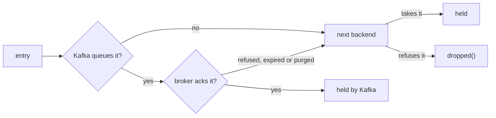

# DLQ

The DLQ (dead-letter queue) is the last-resort sink for messages the
primary pipeline couldn't deliver — parse errors, validation
failures, persistent transport failure, `TieredSink::SpoolFull`,
poison records. Every data-plane service shares one DLQ orchestrator built
from cascade config.

The orchestrator is `Dlq` — a clone-cheap handle wrapping a
`BackgroundSink<DlqEntry>`. Calling `send` queues the entry on an
in-memory mpsc and returns. A drain task pulled out of the runtime
loop coalesces queued entries into batches and writes to one or more
backends. Callers never block on disk, Kafka, or HTTP I/O.

---

## Three backends

| Backend | Feature | Storage |
| --------- | --------- | --------- |
| File | `dlq` (always available) | NDJSON to disk via the shared `io::NdjsonWriter`, with rotation (`Hourly` default) and gzip on rotation |
| Kafka | `dlq-kafka` (needs `transport-kafka`) | Publish to a dedicated DLQ topic -- per-table (`acme.auth` -> `acme.auth.dlq`) or single common topic (`<service>.dlq` unless `common_topic` names one) |
| HTTP | `dlq-http` (needs `reqwest`) | POST batched entries as NDJSON |

After a refused write the file backend reopens its file on a later write, waiting 250 ms and doubling up to 30 s while writes keep failing. So a deleted file or a restored directory recovers without a restart. It never recreates a missing directory, because that could put the DLQ on the filesystem under an unmounted volume. While its file is missing it refuses writes before they reach `file-rotate`, whose rotation would otherwise panic -- an abort in a `panic = "abort"` service.

External rotation of the DLQ file (logrotate, say) is unsupported: the backend rotates it itself. If something renames the file and puts a new one at the path, the writes until the next reopen report lost and count in `dropped()`, although their entries are in the renamed file.

Backends are concrete variants of a `DlqBackend` enum (static
dispatch, no `Box<dyn>`, no `async-trait` macro). Adding a new backend
means extending the enum in scalo — consumers never construct backend
types directly.

### The Kafka barrier

The Kafka backend queues entries to the producer on every write and learns their fate only from the broker, so `flush()` waits for the broker's acks -- `acks=all` unless the sizing surface turns idempotence off:

- The wait runs on tokio's blocking pool, so a slow or absent broker holds no runtime worker. It lasts up to `kafka.send_timeout_ms` (default 5000 ms), plus up to 5 s to purge.
- Entries still unacknowledged after `send_timeout_ms` are purged from the producer, which fails their delivery.
- `Cascade` with a backend after Kafka: an entry whose delivery failed since the previous `flush()`, refused by the broker or purged, goes on to that backend before the barrier flushes it. It counts as accepted once that backend takes it, and is lost only if every backend after Kafka refuses it too.
- `KafkaOnly`, `FanOut`, or `Cascade` with nothing after Kafka: such an entry fails the `flush()` with `Err(DlqError::Kafka(..))` and is counted in `dropped()` and `dlq_dropped_total{reason="backends_failed"}`, like a refused write.
- The purge bounds the wait, but an entry already in flight to a stalled broker, not a dead one, can still be written after it. So under a stalled broker the DLQ topic can hold an entry the file backend also took, and `dropped()` can count one the topic holds: duplicates, never a gap.
- `Cascade`: when Kafka queues part of a batch and refuses the rest (an entry over the producer's `message.max.bytes`, say), only the rest goes on to the next backend.
- `FanOut`: a Kafka loss counts only for entries no other backend took. When one barrier covers both kinds and Kafka lost some, the loss is charged to the entries Kafka held alone first, so the count can overstate the loss but never understate it.

Delivery failures are read at every write, at the barrier and at [shutdown](#shutdown). Without a `flush()` an entry the broker never acks waits in the producer until librdkafka's `message.timeout.ms` (300000 ms unless set) fails it. It shows in `transport_send_errors_total{transport="kafka"}` and the producer's WARN log, then goes on to the next backend at the next write in `Cascade`, or counts in `dropped()` at the next `flush()` or shutdown otherwise.

---

## Modes

| Mode | Behaviour |
| ------ | ----------- |
| `Cascade` (default) | Try backends in order (Kafka -> File -> HTTP), stop on the first that takes the entry; an entry the broker never acks goes on to the next |
| `FanOut` | Write every batch to every enabled backend, succeed if at least one takes the whole batch |
| `FileOnly` | File backend only — no Kafka dependency |
| `KafkaOnly` | Kafka backend only |

Cascade is the production default -- Kafka primary, file fallback. An entry falls through to the file when the producer refuses to queue it (a full producer queue, or an entry over its `message.max.bytes`), and when the producer queued it but the broker refused it or never acked it. So an unreachable broker loses no dead letters while the file backend takes them: they land in the file at the next `flush()` or shutdown, which purge what is unacked, or at the next write once librdkafka has failed the delivery (`message.timeout.ms`, 300 s unless set). See [The Kafka barrier](#the-kafka-barrier). FanOut is for compliance setups that need every entry mirrored to two destinations.



Each entry that falls through and lands counts once in `dlq_cascade_fallthrough_total{from, to, reason}`: `from` is the backend that gave it up, `to` the one that took it, and `reason` is `write_refused` (the backend refused the write itself), `delivery_failed` (the broker refused it) or `ack_timeout` (no ack came in time, so it expired or was purged). A rising `reason="ack_timeout"` with `to="file"` is a broker outage the file backend is covering.

---

## Queue-admission semantics

`send` / `try_send` return as soon as the entry is on the in-memory
queue -- **not** when a backend has it. `flush` is the barrier that
says whether the backends took everything:

```rust
dlq.send(entry).await?;     // queued (non-blocking)
dlq.flush().await?;         // every entry queued before this call is
                            // written, and no write was refused
```

`flush()` returns once the drain has written every entry queued before
the call. It returns `Ok` only if every batch the drain wrote since the
previous `flush()` was accepted by a backend. That covers all three
write triggers: a full batch (`batch_size`), the `flush_interval_ms`
tick, and the batch the barrier itself writes.

If every backend refused a batch, the next `flush()` returns `Err(DlqError::File(..))`, and so does an entry the broker never acked that every backend after Kafka refused. Entries only the Kafka backend held that the broker refused or never acked, with no backend after Kafka to take them, return `Err(DlqError::Kafka(..))`. The drain does not retry refused entries. They are counted in `dropped()` and in `dlq_dropped_total{reason="backends_failed"}`.

A refusal is reported once. The first barrier the drain processes after
it returns the error, and the `flush()` after that starts clean. With
concurrent callers, the other barriers return `Ok`.

A `flush()` dropped before its ack, such as by a timeout around it, does
not consume the error. The next `flush()` returns it.

A caller that must know whether ITS entries are held, rather than whether
anything written since the last barrier was refused, uses
`write_confirmed(entries)`. The drain writes those entries as a batch of
their own, runs the durable flush, and answers that caller alone: a
refusal of anyone else's write stays for the next `flush()`, and this
caller's refusal goes to this caller only. The durable flush covers every
earlier write too, so a loss it finds is returned to the caller and held
for the next `flush()` as well. A Kafka backend that purged entries it has
not heard back about yet fails the confirmed write. The pipeline's
`with_dlq` writes each block's dead letters this way.

An error from `write_confirmed` does not say whether a retry can land the entries, and a caller holding a source acknowledgement needs to know. `refusal(&entry)` answers it before the write, per entry: `Some(DeadLetterReason::TooLarge { bytes, limit })` when no backend can ever hold the entry, `None` otherwise. Only a Kafka backend has a ceiling, its producer's `message.max.bytes` less 128 bytes of framing, measured against the entry as written, so a payload grows by a third as base64. A file or HTTP backend beside Kafka takes what Kafka refuses, so such a DLQ refuses nothing.

So a caller holding a source acknowledgement:

- leaves a refused entry out of the write, releases it `Dropped`, and counts it, since no retry can land it
- holds the block and writes the rest again on any other error, since those can clear: a broker down, a timeout, a full disk
- releases `Errored` only on `DlqError::Closed`, when the drain has exited

A broker or topic ceiling below the producer's `message.max.bytes` is not seen by `refusal`: the broker refuses the entry after the write, and the confirmed write fails like any other loss. Keep the three ceilings in step ([../transport/backends.md](../transport/backends.md)).

What "accepted" means depends on the backend:

| Backend | Accepted means |
| --------- | ---------------- |
| File | Written to the kernel page cache. No `fsync`, so power loss before write-back can still lose it |
| Kafka | Acknowledged by the broker, under the producer's `acks` setting. The barrier waits up to `kafka.send_timeout_ms` -- see [The Kafka barrier](#the-kafka-barrier) |
| HTTP | The endpoint returned a 2xx status. The barrier adds no wait: the write already waited for the response |

An entry refused at admission (`try_send` returning `QueueFull`) never
reached the queue, so `flush()` does not cover it -- `dropped()` does.

For at-least-once handling, `flush().await` before treating a dead
letter as safe, and read `Err` as "entries written since the last flush
were lost". Most callers don't need to -- DLQ delivery is best-effort
by design and the drain will eventually write.

`try_send` returns `Err(DlqError::QueueFull)` immediately when the
in-memory queue is full (`Overflow::Drop`). The drop counter is
incremented for visibility — the caller decides whether to log,
escalate, or proceed.

---

## Shutdown

The drain finishes its in-flight batch, drains the remaining queue,
then exits. Triggered by either:

- `CancellationToken::cancel()` passed to `spawn`, or
- All `Dlq` handles dropped (channel closes naturally).

Then `Dlq::shutdown().await` joins the drain task. Idempotent — safe
to call from any clone.

Before it exits the drain waits for the Kafka backend's acks the way a `flush()` does: up to `kafka.send_timeout_ms`, plus up to 5 s when it has to purge. Dropping the producer afterwards discards whatever it still holds, so first the drain hands every entry only Kafka held that the broker refused or never acked to the backend after Kafka in `Cascade`, and counts what no backend took in `dropped()` and `dlq_dropped_total{reason="backends_failed"}`. `shutdown()` returns `Ok` either way; a caller that needs the loss as an `Err` calls `flush()` before it.

The count lands only if the drain gets to finish. Await `shutdown()`, or keep the runtime up until the drain exits: a drain dropped mid-wait counts nothing.

---

## Configuration

```yaml
dlq:
  enabled: true
  mode: cascade
  queue_capacity: 10000         # in-memory mpsc bound
  batch_size: 256                # drain coalescence
  flush_interval_ms: 100         # partial-batch flush
  file:
    enabled: true
    path: /var/spool/scalo/dlq   # the service name is appended as a subdirectory
    rotation: hourly             # hourly | daily
    max_age_days: 30
    compress_rotated: true
  kafka:                         # dlq-kafka feature
    enabled: true
    routing: per_table           # per_table | common
    topic_suffix: .dlq
    common_topic: errors.dlq     # unset: <service>.dlq, the service Dlq::spawn is given
    send_timeout_ms: 5000        # ack wait for flush() and shutdown; the purge after it adds up to 5 s
  http:                          # dlq-http feature
    enabled: false
    endpoint: https://dlq.example/ingest
```

---

## Upgrading from the older DLQ API

Earlier releases exposed `Dlq::file_only` / `Dlq::with_kafka` constructors
and a `DlqBackend` trait object. Both are gone — every backend mix now goes
through `Dlq::spawn` with `DlqMode` selecting routing, and `DlqBackend` is an
enum (static dispatch). The orchestrator gained `try_send` (non-blocking,
`QueueFull` on overflow), `flush` (write barrier), and `shutdown`
(drain + join). `send` semantics changed from "wait for durable write" to
queue-admission — see [Queue-admission semantics](#queue-admission-semantics).

The version-keyed upgrade path lives in [migrations.md](../migrations.md).

---

## API surface

| Item | Purpose |
| ------ | --------- |
| `Dlq::disabled()` | No-op handle — `send` succeeds, nothing written; each routed entry is counted in `dropped()`, emitted as `dlq_dropped_total{reason="disabled"}`, and logged at ERROR (rate-limited) |
| `Dlq::spawn(config, service_name, kafka_config, shutdown)` | Build backends, spawn drain, return cloneable handle |
| `try_send(entry) -> Result<(), DlqError>` | Sync-shape queue submission; `QueueFull` on overflow |
| `send(entry).await` | Async submission that awaits queue space |
| `send_batch(entries).await` | Queue many entries (drain coalesces) |
| `flush().await` | Barrier -- wait until every entry queued before this call is written, and acked where the backend is Kafka; `Err(File)` if any batch written since the previous flush was refused by every backend, `Err(Kafka)` if Kafka lost entries only it held (see [Queue-admission semantics](#queue-admission-semantics)) |
| `write_confirmed(entries).await` | Write these entries as a batch of their own and answer whether a backend holds them, to this caller alone (see [Queue-admission semantics](#queue-admission-semantics)) |
| `refusal(&entry)` | Why no backend can ever hold this entry, or `None`: the permanent refusal a held source releases `Dropped` (needs `transport`) |
| `shutdown().await` | Stop the drain and join it; the drain first waits for Kafka acks and counts what none confirmed in `dropped()` (see [Shutdown](#shutdown)) |
| `is_enabled() / mode() / pending() / dropped()` | Introspection — `dropped()` totals queue overflow (`dlq_dropped_total{reason="overflow"}`) + disabled-DLQ sends + batches every backend refused + Kafka entries a barrier or the shutdown found lost (`dlq_dropped_total{reason="backends_failed"}` + rate-limited ERROR) |
| `DlqEntry::new(service, error_type, payload)` + `.with_destination(...)`, `.with_source(...)`, `.with_metadata(...)` | Entry builder |
| `DlqSource::kafka(topic, partition, offset) / ::http(url) / ...` | Provenance for the entry |
| `DlqBackend` (enum) | `File / Kafka / Http` — feature-gated variants |
| `DlqMode` | `Cascade / FanOut / FileOnly / KafkaOnly` |
| `DlqError` | `Io / Serialization / File / Kafka / BackendError / AllBackendsFailed / NotConfigured / QueueFull / Closed` |

`Dlq` is `Clone` — clones share the same drain. The single-owner
shutdown handle lives inside `Arc<AsyncMutex<Option<...>>>` so any
clone can call `shutdown()`.

---

## Source

- [`../../src/dlq/mod.rs`](../../src/dlq/mod.rs)
- [`../../src/dlq/orchestrator.rs`](../../src/dlq/orchestrator.rs) — `Dlq`, `DlqDrain`, cascade/fan-out dispatch
- [`../../src/dlq/backend.rs`](../../src/dlq/backend.rs) — `DlqBackend` enum
- [`../../src/dlq/config.rs`](../../src/dlq/config.rs)
- [`../../src/dlq/entry.rs`](../../src/dlq/entry.rs) — `DlqEntry`, `DlqSource`
- [`../../src/dlq/file.rs`](../../src/dlq/file.rs)
- [`../../src/dlq/kafka.rs`](../../src/dlq/kafka.rs)
- [`../../src/dlq/http.rs`](../../src/dlq/http.rs)

---

## Related

- [tiered-sink.md](tiered-sink.md) — common upstream caller (routes `SpoolFull` / `Fatal` to DLQ)
- [batch-engine.md](batch-engine.md) — parse errors and pre-route DLQ outcomes flow here
- [../transport/README.md](../transport/README.md) — Kafka backend reuses `KafkaConfig`
- [../transport/filter-engine.md](../transport/filter-engine.md) — wire-level filter drains DLQ entries here
- [../feature-flags.md](../feature-flags.md) — `dlq`, `dlq-kafka`, `dlq-http`
- [../auto-wiring.md](../auto-wiring.md)
- [../architecture.md](../architecture.md)
