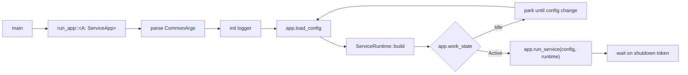

# Service Runtime

`ServiceRuntime` is the pre-wired infrastructure object that every
data-plane service receives from `run_app` before its `run_service` method
is called. It collapses the identical startup boilerplate every
service would otherwise hand-write into a single typed struct.

A service author writes `ServiceApp::run_service(config, runtime)` and
uses the runtime's fields directly -- metrics manager, memory guard,
shutdown token, worker pool, batch engine, scaling pressure,
self-regulation governor, K8s context. Nothing to plumb, nothing to
remember to register.

---

## What's in the runtime

| Field | Type | Feature gate | Always present? |
| ------- | ------ | -------------- | ----------------- |
| `metrics` | `MetricsManager` | always (with `metrics`) | yes |
| `dfe` | `Arc<ServiceMetrics>` | always (with `metrics`) | yes |
| `memory_guard` | `Arc<MemoryGuard>` | `memory` | yes |
| `shutdown` | `CancellationToken` | always | yes |
| `context` | `&'static RuntimeContext` | always | yes |
| `worker_pool` | `Option<Arc<AdaptiveWorkerPool>>` | `worker-pool` | optional |
| `batch_engine` | `Option<Arc<BatchEngine>>` | `worker-batch` | optional |
| `scaling` | `Option<Arc<ScalingPressure>>` | `scaling` | optional |
| `governor` | `Option<SelfRegulationGovernor>` | `governor` | optional (default-on) |

The pillars (`metrics`, `dfe`, `shutdown`, `context`) are always
present. The optional fields are `Some(...)` when their feature is
on and configuration succeeds -- `None` if construction fails (logged
as a warning, not fatal).

`governor` is the exception: its feature is on by default. It is
`None` only when opted out via `self_regulation.enabled = false`, in
which case nothing is constructed and the data path is byte-identical
to pre-governor. See [self-regulation.md](../self-regulation.md).

The bundle is enabled via the `cli-service` feature, which pulls in
`metrics + memory + scaling + shutdown + governor + sink-stack +
lifecycle`. The worker pool is opt-in: add `worker-pool` for
`worker_pool`, or `worker-batch` for it and `batch_engine`, and the
runtime builds and wires them. Without either, neither field exists and
rayon is not compiled.

---

## Lifecycle



Step by step inside `run_app` for the default `run` subcommand:

1. Resolve the subcommand from `app.command()` -- defaults to `Run`.
2. Install the logger with the service name and version injected for
   JSON output.
3. Call `app.load_config(args.config.as_deref())` -- apps own this
   step so they can deserialise into their own typed config.
4. Build `ServiceRuntime`:
   - Construct `MetricsManager` under `metrics.namespace`, describe the
     scalo runtime set (`ServiceMetrics`, app info, worker pool and batch
     engine metrics when compiled in) -- the same set the manifest lists.
   - Construct `MemoryGuard` from env prefix (cgroup auto-detect).
   - Construct the self-regulation governor from the same guard if
     `governor` is on and not opted out. Built before the worker pool,
     batch engine, and transports so its pressure and byte budget can
     thread into all of them.
   - Construct `ScalingPressure` from cascade if `scaling` is on,
     wire it into the metrics manager.
   - Construct `AdaptiveWorkerPool` from cascade if `worker-pool`
     is on, register its metrics, hand it the memory guard and
     scaling pressure.
   - Construct `BatchEngine` if `worker-batch` is on, auto-wire it
     to the metrics manager and memory guard, wire the governor's
     byte budget into its governed run path.
   - Install signal handler -- returns `CancellationToken`.
   - Start the worker pool scaling loop.
   - Start the metrics server on `args.metrics_addr`.
   - Fire-and-forget version check if `version-check` is on: enabled by
     default, inert until `version_check_defaults()` or config supplies an
     `api_url`, and `version_check.enabled: false` in any config layer
     turns it off.
5. Evaluate `app.work_state(&config)`. Idle parks the service, Ready and
   with nothing open, until a config change gives it work -- see
   [../core-pillars/lifecycle.md](../core-pillars/lifecycle.md).
6. Call `app.run_service(config, runtime)`.

The service author's code starts at step 6 -- everything before that
is the framework.

---

## ServiceApp trait

```rust
pub trait ServiceApp: Sized {
    type Config: DeserializeOwned + Debug + Send + Sync;

    fn name(&self) -> &str;
    fn env_prefix(&self) -> &str;
    fn version_info(&self) -> VersionInfo;
    fn common_args(&self) -> &CommonArgs;
    fn load_config(&self, path: Option<&str>) -> Result<Self::Config, CliError>;
    fn run_service(
        &self,
        config: Self::Config,
        runtime: ServiceRuntime,
    ) -> impl Future<Output = Result<(), CliError>> + Send;

    // Optional -- defaults provided.
    fn command(&self) -> Option<&StandardCommand> { None }
    fn work_state(&self, _: &Self::Config) -> WorkState { WorkState::Active }           // cfg: lifecycle
    fn scaling_components(&self, _: &Self::Config) -> Vec<ScalingComponent> { vec![] }  // cfg: scaling
    fn register_metrics(&self, _: &MetricsManager) {}                                   // cfg: metrics | otel-metrics
    fn deployment_contract(&self) -> Option<DeploymentContract> { None }                // cfg: deployment
    fn version_check_defaults(&self) -> VersionCheckConfig { Default::default() }       // cfg: version-check
}
```

| Method | Required? | Purpose |
| -------- | ----------- | --------- |
| `name` | yes | Service name -- log tags, OTel `service.name`, the manifest's `app`. The metric prefix is `metrics.namespace`, bare by default |
| `env_prefix` | yes | Prefix for env-var config overrides (`DFE_LOADER_*`) |
| `version_info` | yes | Version + commit + build timestamp |
| `common_args` | yes | Returns the embedded `CommonArgs` clap struct |
| `load_config` | yes | App-specific cascade load (typically `config::setup` + `unmarshal`) |
| `run_service` | yes | The actual service loop -- gets a fully wired runtime |
| `command` | no | Override to expose app-specific subcommands |
| `work_state` | no (cfg `lifecycle`) | The emptiness predicate: a valid but workless config idles instead of refusing |
| `scaling_components` | no (cfg `scaling`) | Register app-specific KEDA signals (lag, queue depth) |
| `register_metrics` | no (cfg `metrics`) | Describe the app's own metrics for `metrics-manifest` / `generate-artefacts`. The scalo runtime set is always in the manifest, so an override adds only what the app emits itself |
| `deployment_contract` | no (cfg `deployment`) | Build the contract for `generate-artefacts` |
| `version_check_defaults` | no (cfg `version-check`) | Supply the service's releases endpoint; the cascade overlays it, `version_check.enabled: false` always wins |

Apps that don't override the optional methods get sensible no-op
defaults. The cfg-marked ones only exist when their feature is compiled
in.

---

## Standard subcommands

`run_app` dispatches on `StandardCommand` before reaching the
service loop. Every service gets the same six subcommands without
writing any extra code:

| Subcommand | Behaviour |
| ------------ | ----------- |
| `run` | Default -- full lifecycle, ends in `run_service` |
| `version` | Print `version_info()` and exit |
| `config-check` | Load logger + config, print summary, exit non-zero on failure |
| `metrics-manifest` | Load config (best-effort, for `metrics.namespace`), describe the scalo runtime set, call `register_metrics`, print manifest JSON to stdout, exit. Warnings go to stderr |
| `generate-artefacts --output-dir <dir>` | Load config once (best-effort, a failure warned on stderr), then emit `metrics-manifest.json`, `deployment-contract.json`, `container-manifest.json`, `Dockerfile.runtime`, `argocd-application.yaml`. Refuses, writing nothing, a contract whose `default_config` binds a listener no port declares |
| `top` | Live metrics TUI (when `top` feature is on) |

`config-check` exists so CI can validate config without booting the
service. `metrics-manifest` and `generate-artefacts` exist so CI can
generate deployment artefacts deterministically -- same build and
config, same output, no timestamps. The artefacts follow the config
cascade, so different settings or env vars give different artefacts.

---

## Readiness check

The runtime installs no readiness check of its own. Until an app sets
one, `/readyz` answers from the health registry alone: ready as soon as
the metrics listener serves and no registered component is unhealthy.
Each app sets its check once it knows what "ready" means for its
domain:

```rust
async fn run_service(&self, config: Self::Config, mut runtime: ServiceRuntime)
    -> Result<(), CliError>
{
    // ... wire pipeline ...
    let p = Arc::clone(&pipeline);
    runtime.set_readiness_check(move || p.is_consuming());
    // ... run loop ...
}
```

`set_readiness_check` takes a `Fn() -> bool + Send + Sync + 'static`
closure that the metrics server's `/readyz` handler calls on every
probe.

---

## What stays app-specific

The runtime deliberately stops short of full automation. These
remain in app code because they're genuinely domain-specific:

- Readiness criteria -- each service has its own "I can serve traffic" definition.
- Config hot-reload -- optional, and the reload semantics differ per app.
- Pipeline construction -- the whole point of the service.
- DLQ wiring -- varies by transport backend and policy.
- App-specific metric groups (`ConsumerMetrics`, `BufferMetrics`).

---

## API surface

| Item | Purpose |
| ------ | --------- |
| `ServiceApp` trait | Service contract -- implement to get the standard lifecycle |
| `run_app::<A>(app)` | Drives the lifecycle; matches subcommand, builds runtime, calls `run_service` |
| `ServiceRuntime` | Pre-wired infrastructure bundle -- built by `run_app`, passed to `run_service` |
| `ServiceRuntime::set_readiness_check(fn)` | Install the app's readiness criterion |
| `ServiceRuntime::batch_engine()` | Borrow the batch engine if `worker-batch` is on |
| `ServiceRuntime::governed_receiver(key)` | Build a receive transport with the governor's inbound brake wired in (cfg `governor` + `transport`); falls back to a plain receiver when the governor is off |
| `StandardCommand` | Subcommand enum -- apps embed via `#[command(flatten)]` |
| `CommonArgs` | Standard CLI flags (`--config`, `--log-level`, `--metrics-addr`, ...) |
| `VersionInfo` | Service version + commit + build timestamp |
| `CliError` | Lifecycle error type -- service errors wrap into `Service(String)` |

---

## Testing

`ServiceRuntime::build` is `pub(crate)` -- tests don't construct it
directly. For unit tests of `run_service`, build only the bits you
need (`MetricsManager::new_for_test`, `CancellationToken::new`,
explicit `MemoryGuard`) and skip the framework. Integration tests
that boot the full runtime go through `run_app` with a fake config
fixture.

---

## Related

- [../auto-wiring.md](../auto-wiring.md) -- singleton pattern across pillars
- [../integration.md](../integration.md) -- service skeleton recipe
- [runtime-context.md](runtime-context.md) -- `RuntimeContext` detection
- [memory.md](memory.md) -- `MemoryGuard`
- [self-regulation.md](../self-regulation.md) -- governor, inbound brake, AIMD budget
- [../core-pillars/shutdown.md](../core-pillars/shutdown.md) -- signal handler, K8s pre-stop
- [../core-pillars/config.md](../core-pillars/config.md) -- cascade
- [../feature-flags.md](../feature-flags.md) -- `cli`, `cli-service`, `governor`
- Source: [../../src/cli/runtime.rs](../../src/cli/runtime.rs),
  [../../src/cli/app.rs](../../src/cli/app.rs),
  [../../src/cli/commands.rs](../../src/cli/commands.rs)
