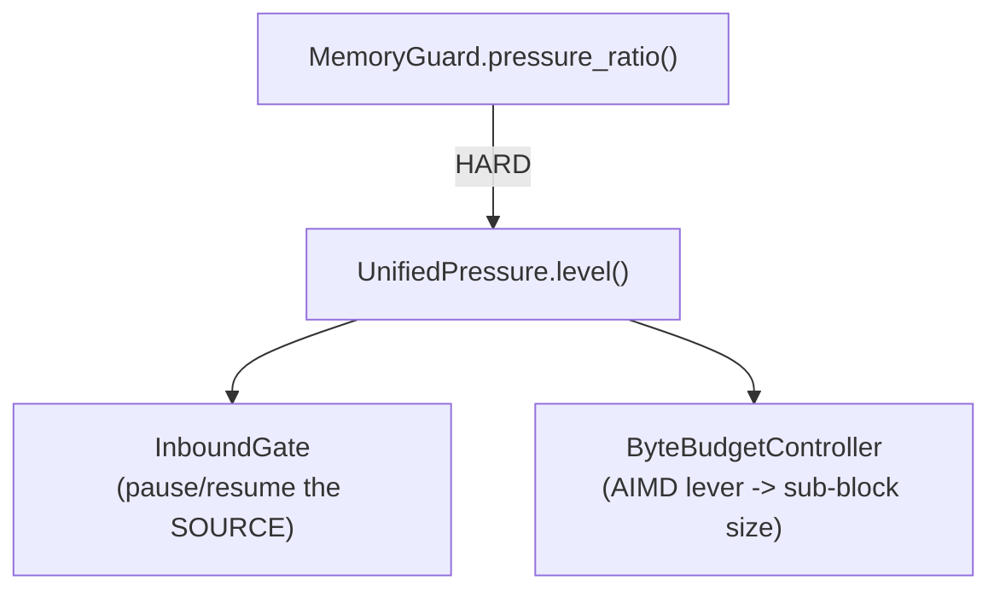

# Self-regulation

The data plane regulates itself. When a burst arrives, an upstream stalls,
or a transform balloons memory, a scalo app sized for steady state slows its
own intake, lets the in-flight work drain, and speeds back up once the
pressure clears. This happens automatically; an app wires nothing. The
limits are under "What the brake guarantees" below.

Self-regulation is **ON by default**. To turn it off (byte-identical to the
pre-governor data path), set one cascade key:

```yaml
self_regulation:
  enabled: false
```

When `enabled = false` the runtime constructs NOTHING -- no pressure
governor, no inbound gate, no byte-budget controller. Every `Option` stays
`None` and the data path is the original whole-batch loop. There is no
half-on state.

See also [backpressure.md](backpressure.md) (where the brake is applied and
why) and [kafka-path.md](kafka-path.md) (how the Kafka GET/PROCESS/SEND
batch sizes feed the loop). The code lives in `src/governor/`.

---

## Self-regulation: the default vertical-scaling principle

Self-regulation is how a scalo app scales VERTICALLY -- a single pod
adapting its OWN intake to its OWN resources. It is the DEFAULT and the
FIRST response to pressure, and it is distinct from (and complementary to)
HORIZONTAL scaling, where KEDA adds pods.

The doctrine, in one line: a pod sized for steady state regulates its own
intake FIRST -- it slows down or speeds up WITHIN the pod -- and only
escalates to horizontal scale (more pods) once its vertical headroom is
exhausted. Vertical is the fast, local, free response; horizontal is the
slow, global, capacity response. They are not alternatives. Vertical buys
time; horizontal adds capacity when the time runs out.

Memory is the hard authority on the vertical side, and the only signal that shrinks the byte budget. CPU is left to CFS: under a CPU quota the Linux scheduler throttles the process and each batch takes longer. There is no separate CPU brake: a pod short of CPU falls behind, and the lag that builds is the autoscaler's signal (see "Why memory is HARD and CPU is deliberately dropped" below).

Self-regulation is ON by default. Opt out with `self_regulation.enabled =
false`, which builds nothing on the vertical side; horizontal scaling via
`ScalingPressure` is unaffected.

### Vertical vs horizontal

| | Vertical (self-regulation) | Horizontal (KEDA) |
|---|---|---|
| Question | "Should this pod pull more work right now?" | "Do we need more pods?" |
| Mechanism | MemoryGuard + UnifiedPressure inbound gate + AIMD byte budget | ScalingPressure -> external-scaler signal -> KEDA |
| Lives in | This library, in-pod | This library's signal; KEDA acts on it |
| Scope | One pod, its own intake | The whole deployment, replica count |
| Timescale | Milliseconds | Seconds to minutes (pod start) |
| Cost | Free -- no new capacity | A new pod |
| Default | ON | Driven by the same pressure / lag signal |

The two compose rather than compete. The SAME pressure that brakes a pod's
intake also surfaces as consumer lag (Kafka) or queue depth, which is the
signal `ScalingPressure` feeds to KEDA. Braking intake on one pod buys time
for the in-flight buffer to drain; sustained pressure that the brake cannot
clear is exactly the condition that should add a replica. See the
`Pressure -> lag -> KEDA` section in [backpressure.md](backpressure.md) and
[pipeline/scaling.md](pipeline/scaling.md) for the KEDA signal.

---

## The three brains

Self-regulation is three distinct controllers with three distinct jobs.
They are NOT interchangeable; each answers a different question.

| Brain | Question | Acts on | Source of truth? |
|---|---|---|---|
| **MemoryGuard** | "Are we about to OOM?" | The HARD pressure signal | YES -- the HARD signal |
| **ScalingPressure** | "Do we need more pods?" | KEDA / external scaler signal | Pool sizing, not the data path |
| **UnifiedPressure** | "Should I pull more work right now?" | The inbound gate + byte budget | Derived from the sources above |

- **MemoryGuard** (`src/memory/`) is the source of truth. Its
  `pressure_ratio()` is the process's memory usage over an effective limit.
  Usage is what the kernel charges: cgroup v2 `memory.current`, else cgroup
  v1 `memory.usage_in_bytes`, else `/proc/self/status` `VmRSS`, each plus the
  bytes admitted since that reading. Only where none is readable (non-Linux)
  does the guard fall back to the bytes callers reserve and release. A heap
  source registered with `set_heap_source` overrides all of them. The limit is
  `min(cgroup_headroom * memory.max, memory.high)`, with `cgroup_headroom`
  defaulting to 0.85, or `memory.limit_bytes` when set. Detail:
  [runtime/memory.md](runtime/memory.md). The ratio feeds the governor as a
  **HARD** source: never weighted, never masked, so a saturated soft signal
  can never lower the combined level below what memory demands.
- **ScalingPressure** (`src/scaling/`) drives horizontal scaling. It emits
  the external-scaler signal KEDA reads to add or remove pods. It is a
  capacity lever, not a data-path lever -- it does not pause intake, it
  asks for more replicas. See [pipeline/scaling.md](pipeline/scaling.md).
- **UnifiedPressure** (`src/governor/source.rs`) combines the sources into
  ONE normalised level in `[0.0, 1.0]` under a hysteretic latch. It is what
  the inbound gate and the byte-budget controller both consult. It owns no
  signal of its own -- it is the seam that turns the brains' readings into
  a single pause/resume decision.

### Why memory is HARD and CPU is deliberately dropped

Memory is the only resource that kills the process. Run out of CPU and the
work merely runs slower; run out of memory and the kernel OOM-kills the pod
and in-flight data is lost. So memory is the HARD source -- the one signal
that always gets through.

CPU is deliberately NOT a pressure source:

- **CFS self-corrects.** Under a CPU quota the Linux scheduler throttles the process for us. A CPU-bound stage simply takes longer per batch. The byte budget does not react to that: a busy stage is not short of memory, and smaller blocks would only add per-call overhead.
- **CPU saturation surfaces as lag, and lag is KEDA's job.** A pod that
  cannot keep up grows consumer lag; KEDA reads the lag and adds a replica.
  Horizontal scale is the right answer to "not enough CPU", not pausing
  intake on the one pod that is already maxed.

The seam is built to accept a CPU source LATER with **zero API change**.
`UnifiedPressure::add_source` takes any `PressureSource`; a future CPU
source would plug in as a SOFT, weighted source and every existing caller
of `level()` / `should_hold()` is untouched. The decision to drop CPU is a
default, not a wall.

### The memory signal: max, high, and PSI

The HARD memory source reads the container's own cgroup, not host `used/total`
(on a shared node the host figure is unrelated to this pod's limit). Three
cgroup v2 inputs, container-first:

- **`memory.max`** -- the hard ceiling. Cross it and the kernel OOM-kills the
  pod. The guard's ratio is `memory.current / (0.85 * memory.max)`, so the
  default `pause_above` of 0.80 arms at 68% of `memory.max`.
- **`memory.high`** -- the soft throttle. The kernel reclaims hard and throttles
  allocations here, BEFORE the OOM-kill. When `memory.high` is below
  `0.85 * memory.max` it is the guard's limit, so the brake arms before the
  throttle's latency cliff, not just before the kill. The worker-pool scaler's
  `detect_memory_pressure()` takes the worst of `current/max` and
  `current/high`, without the headroom.
- **`memory.pressure` (PSI `some avg10`)** -- the earliest signal: the fraction
  of the last 10s in which a task stalled on memory. Emitted as the
  `worker_pool_memory_psi_some` gauge for observability/alerting. NOT folded
  into the shed decision -- the actionable stall-percent is workload-specific
  and wants per-service calibration, not a guessed constant.

---

## How the loop works



- **The latch** (`UnifiedPressure`, `src/governor/source.rs`) arms at
  `pause_above` and releases at `resume_below`. A hold is bounded in time:
  memory the process already holds (allocator arenas, pages kept after a
  free) can keep the level above `resume_below` with nothing coming in, which
  would pause the source for good. After `max_hold_secs` (default 30) the
  latch admits one window, then re-arms if the level is still at
  `pause_above`. The window is one admission for a push source. For every `InboundGate` on the latch it is one resume that stays open until a receive returns records, or 2 s pass: a resumed Kafka consumer has to fetch before it returns anything, so the first receive after the resume is often empty. The byte budget never takes the window.
- **InboundGate** (`src/governor/gate.rs`) turns the latch into EDGE events:
  `pause()` once on the rising edge, `resume()` once on the falling edge. It
  pauses the inbound SOURCE (stops pulling new work) -- never the outbound
  drain. See [backpressure.md](backpressure.md) for why gating the drain
  deadlocks.
- **ByteBudgetController** (`src/governor/budget.rs`) is an AIMD (additive-increase / multiplicative-decrease) lever that sizes the inbound byte budget: the payload bytes one receive retains and one sub-block holds. The byte budget shrinks only under memory pressure: while the latch holds, each block shrinks it by `md_factor` toward its floor, and otherwise each block grows it by the profile's step toward the profile's ceiling. Utilisation and CPU saturation are the autoscaler's signal, not the budget's. Under a backlog a stage is about as busy at every block size, so a budget that shrank on utilisation would fall to its floor and cap throughput at the sink's per-call cost. See [kafka-path.md](kafka-path.md) for the PROCESS byte-budget's place among the three Kafka batch sizes.

The controller starts BIG (`start_bytes`), so a cold pipeline is never artificially throttled, and grows toward its ceiling while memory is clear. Without memory pressure the budget stays at or above its start value, so a received block becomes a SINGLE sub-block with no per-record overhead: behaviour matches the whole-batch loop. Near-zero cost off-pressure.

The governed driver (`BatchEngine::run_governed`) is the run path a
self-regulating app calls. It dispatches on whether the byte budget is wired:
budget present -> stream in sub-blocks sized to the current budget and fold
each block into it;
budget absent (governor off) -> delegate verbatim to `run_workbatch`,
byte-identical to pre-governor behaviour. The streaming sub-block mechanics
live in [backpressure.md](backpressure.md).

---

## Observe

Self-regulation is visible, not mysterious. When throttling happens you can
see it.

| Signal | Kind | Meaning |
|---|---|---|
| `self_regulation_inbound_paused` | gauge (0/1) | The inbound gate is currently holding (1) or open (0). Carries a `source` label (e.g. `kafka`, `http`) so two governed receivers on one pod are told apart |
| `self_regulation_inbound_pauses_total` | counter | Number of pause EDGES (rising transitions), not per-evaluate noise. Carries the same `source` label |
| `self_regulation_byte_budget` | gauge | Current AIMD byte budget (the inbound block-size lever), written by the controller at start and on every change |
| `self_regulation_recv_block_bytes` | gauge | Actual bytes of the most recent received block (reality, against which the budget is the intent) |
| `self_regulation_pressure_ratio` | gauge | Combined `UnifiedPressure.level()` in `[0, 1]`, written by the latch on any evaluation that moves it by 0.001 or more, paused or not |
| `self_regulation_max_hold_releases_total` | counter | Holds ended by `max_hold_secs` with the level still above `resume_below`, `signal` label = the source setting the level (`memory`, `ack_held`). A steady rate means memory the brake cannot free is holding the level up |
| `self_regulation_kafka_gate_errors_total` | counter | Kafka pause/resume actuator failures, `op` label = `pause` or `resume`. A sustained non-zero rate means the brake is silently disabled for the Kafka source -- alert on it |

Because the gate fires each edge EXACTLY ONCE (`ObservingActuator` in
`src/governor/gate.rs`), the `self_regulation_inbound_paused` gauge and the
`self_regulation_inbound_pauses_total` counter track real transitions, not
per-evaluate noise. The gate also logs a brake-reason line on each edge:

```text
WARN  self-regulation: inbound PAUSED under pressure (memory/back-pressure brake)  source=kafka
INFO  self-regulation: inbound RESUMED  source=kafka
```

A hold that reaches `max_hold_secs` also logs a WARN, at most once a minute,
`hold reached max_hold`, with the `pressure`, `resume_below`, `held_secs` and
the `signal` that set the level. Pause and resume pairs about `max_hold_secs`
apart, with that warning, mean the level is not falling to `resume_below` --
check the memory guard and consumer lag.

---

## Tune

All tuning is via the `self_regulation` cascade section (7-layer cascade,
hot-reload, `/config` admin endpoint -- same as every other config section;
see [core-pillars/config.md](core-pillars/config.md)).

```yaml
self_regulation:
  enabled: true            # master switch (default true)
  profile: throughput      # throughput | balanced | low_latency -- sizes the AIMD envelope
  pause_above: 0.80        # arm the inbound hold when combined pressure reaches this
  resume_below: 0.65       # release the hold when pressure drops to this (must be < pause_above)
  max_hold_secs: 30        # longest one hold lasts above resume_below; 0 = no bound
  md_factor: 0.5           # byte-budget decrease per block under memory pressure, in (0, 1)
```

- **`enabled`** -- the only knob most apps touch. `false` builds nothing.
- **`profile`** -- sizes the AIMD byte-budget envelope (start / ceiling /
  step / record cap). `throughput` starts big with a high ceiling;
  `low_latency` starts small so blocks stay small and bursty. It mirrors the
  Kafka `SelfRegulationProfile` names so one value reads the same regardless
  of transport.
- **`pause_above` / `resume_below`** -- the hysteresis band. The gap between
  them prevents flapping: the latch arms at `pause_above`, releases at
  `resume_below`, and holds its state in between. An inverted or non-finite
  band falls back to the defaults (`0.80` / `0.65`) with a warning rather
  than wedging the governor.
- **`max_hold_secs`** -- the bound on one hold (see "How the loop works").
  `0` restores the unbounded latch, which holds until the level falls to
  `resume_below` however long that takes.
- **`md_factor`** -- how hard to brake under memory pressure. `0.5` halves the budget per block while the latch holds.
- **`target_rho`** -- has no effect: the byte budget shrinks only under memory pressure. The key is still accepted, so a config that sets it loads unchanged.

Every default is set so an app that configures nothing gets a fully working,
default-ON governor. Bad knobs are sanitised, not fatal.

### Small / memory-tight pods

The default profile is `throughput`, which starts with a large byte budget
(start-big, back-off-on-pressure). That is the right call for a PB/day
ingest pod with headroom, but on a small or memory-tight pod it can spike
in the COLD-START WINDOW -- the very first block is sized to the start
budget before the memory-hard override has seen any pressure to react to. The governor self-corrects after that first block
(the memory-hard override drops the budget the moment in-flight bytes climb
toward the limit), so this is a transient first-block spike, not a steady
state.

There is deliberately NO dedicated "small-pod" preset (YAGNI), and no key
for the start budget: the profile sets it. For a small/memory-tight pod, use
the `balanced` (8 MiB start) or `low_latency` (1 MiB start) profile, so the
cold-start first block is correspondingly smaller. The memory-hard override
then shrinks the blocks after it.

### What the brake guarantees

The brake stops NEW intake once the level reaches `pause_above` and shrinks
the blocks after it. It does not bound memory already admitted, and it cannot
stop an allocation under way: the usage reading can be 50 ms old, and one
block can be larger than the headroom left above the pause point. On a pod
limited to 256-512 MiB a burst has been measured to OOM-kill the process
within about a second with the brake on. So it is load shedding, not an OOM
guarantee: leave headroom above the pause point for the largest block the
pod takes.

### cgroup OOM-kill operational test (release checklist)

The in-process logical test asserts the governor's control loop never lets
in-flight bytes exceed the configured limit. It does NOT prove the process
survives a real OS-level cgroup OOM-killer under a hard container memory
limit. The real test -- a memory-limited container under sustained load,
asserting NO cgroup OOM-kill where an ungoverned pipeline would be killed --
is a RELEASE-CHECKLIST / CI-harness item, run out of process against a real
cgroup. It is not covered by the in-process unit tests and must be exercised
separately before a release.
