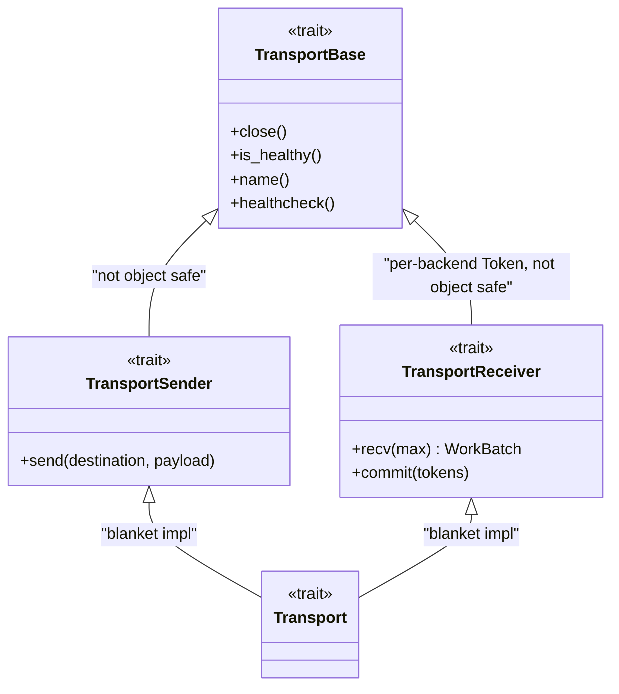

# Overview

The transport layer is the boundary between an app and any
message-shaped backend -- Kafka, gRPC, Memory, File, Pipe,
HTTP. Apps depend on the traits; the concrete backend is selected
at runtime from config. Embedded filter engine, embedded metrics,
embedded propagation -- see [filter-engine.md](filter-engine.md) and
[backends.md](backends.md).

---

## Trait architecture

Four traits stacked, split sender/receiver:



| Trait | Purpose | Object-safe? |
| ------- | --------- | -------------- |
| `TransportBase` | Lifecycle + introspection -- `close()`, `is_healthy()`, `name()`, `healthcheck()` | No -- `close()` and `healthcheck()` return `impl Future` |
| `TransportSender` | Add `send(destination, payload)` -- async fn in trait | Not via `dyn` -- see below |
| `TransportReceiver` | Add `recv` + `commit`, associated `type Token: CommitToken` | No -- `impl Future` returns, and `Token` differs per backend |
| `Transport` | Marker -- blanket impl for `T: Sender + Receiver` | N/A |

`TransportSender::send` returns `impl Future<Output = SendResult> + Send`
-- native async fn in trait. Receivers have the same shape on `recv`
and `commit`. Native async-fn-in-trait is not object-safe -- the
opaque return type means `Box<dyn TransportSender>` won't compile.

The fix is **enum dispatch**, not `dyn`.

---

## `AnySender` and `AnyReceiver` -- the factory return types

```rust
use scalo::transport::AnySender;

let sender = AnySender::from_config("transport.output").await?;
sender.send("events.land", payload).await;
```

`AnySender` is an enum, one variant per backend, gated by feature
flag. It implements `TransportSender` by matching on the variant
and delegating. Static dispatch, no vtable, no `Box`.

`from_config(key).await` reads the `TransportConfig` at the given
cascade key, picks the backend from `transport_type`, and constructs
it. The call is **async** -- backends like Kafka and gRPC do socket
work during construction. Forgetting the `.await` is a compile error.

`from_transport_config(&cfg).await` is the non-cascade variant for
tests or apps that build the config struct by hand.

```rust
use scalo::transport::{AnyReceiver, TransportReceiver};

let receiver = AnyReceiver::from_config("transport.input").await?;
let batch = receiver.recv(100).await?;
// process batch.records and route batch.dlq_entries before committing
receiver.commit(&batch.commit_tokens).await?;
```

`AnyReceiver` is the receive-side mirror, with the same `from_config` and `from_transport_config` constructors. `recv` wraps each backend token in the matching `AnyToken` variant, and `commit` routes those tokens back to the backend that issued them. `AnyToken` is `#[non_exhaustive]`, so a `match` on it needs a wildcard arm.

With the `governor` feature, `AnyReceiver::from_config_with_governor(key, &governor)` and `from_transport_config_with_governor(&cfg, &governor)` also wire the inbound brake: Kafka pauses assigned partitions, HTTP sheds with 503 and gRPC with `unavailable`.

An input stage that needs the backend's own token type takes a concrete `KafkaTransport` / `GrpcTransport` / etc. directly.

---

## Commit tokens

```rust
pub trait CommitToken: Clone + Send + Sync + Debug + Display + 'static {
    fn as_str(&self) -> String { format!("{self}") }
}
```

Every backend defines its own token (`KafkaToken`, `GrpcToken`,
`FileToken`, etc.). The token carries whatever the backend needs to
ack the message -- Kafka offsets, file byte positions, in-memory
sequence numbers. The `Display` impl prints a human-readable form
(e.g. `kafka:events.land:0:12345`, `file:8192`) for logs and DLQ
provenance.

**Commit semantics**: the caller drives commit. Receive a batch, process it, and once every record in it has been delivered or dead-lettered, call `commit(&tokens)` with all of the batch's tokens. Commit no subset while any record of the batch is still undelivered: Kafka commits the highest offset each partition's tokens carry, so a subset commits past an earlier record of that partition the sink has not taken. Token routing back through the same transport is the contract -- commits don't cross transports. Each backend's commit does what's needed:

| Backend | `commit()` effect |
| --------- | ------------------- |
| Kafka | Commits consumer offsets |
| gRPC | No-op -- no persistence |
| File | Persists read position to `.pos` sidecar |
| Memory | Advances internal sequence |
| HTTP | No-op -- the server answered when the record was queued |
| Pipe | No-op -- stdin cannot be read again |

**Releasing**: `release(&tokens, status)` is `commit` with the merged delivery status of every piece built from the tokens' records. `Delivered`, `Dropped` and `Rejected` release the source, and `Errored` withholds it so the records are delivered again. The default commits when the status allows it. A source that can hold its acknowledgement exposes `ack_control()` (`AckControl`: `enabled`, `arm`, `held`) and names a `hold_deadline` where a sender waits on it. Kafka armed commits each partition only up to its lowest offset not yet released, so releases may arrive in any order. The `BatchEngine` pipeline builder drives all of this ([../pipeline/acknowledgements.md](../pipeline/acknowledgements.md)), and a hand-rolled loop uses `SourceAck`. Each ack-capable backend reads `acknowledgements.enabled` (default `true`) from `<key>.<type>.acknowledgements`, beside its own section. Only Kafka and gRPC are ack-capable. HTTP and file sources are not yet, and pipe and memory have nothing to hold, so under those four the section has no effect and the factory warns once per backend ([../pipeline/acknowledgements.md](../pipeline/acknowledgements.md#which-sources-hold-it)).

**Closing a receiver**: after `close()`, `recv` returns the records the source had already acknowledged to their senders, then `TransportError::Closed`. A receiving service therefore shuts down with `close()`, then `recv` until `Closed`, then its final flush; the `BatchEngine` run loops do this at shutdown ([../pipeline/batch-engine.md](../pipeline/batch-engine.md#shutdown)). The HTTP server, the memory transport, and a gRPC server that is unarmed or has acknowledgements off hold acknowledged records until `recv` takes them. An armed gRPC server has acknowledged nothing it still queues: `recv` returns those records too, and each push is answered once its records are released, or `Unavailable` at the drain deadline ([backends.md](backends.md#grpc)). Kafka and file report `Closed` at once and re-deliver what was not committed; pipe acknowledges nothing, and reports `Closed` at once too.

---

## `WorkBatch<Token>` -- what `recv` returns

```rust
pub struct WorkBatch<T: CommitToken> {
    pub records: Vec<Record>,
    pub commit_tokens: Vec<T>,              // source acks for the whole block
    pub dlq_entries: Vec<FilteredDlqEntry>, // inbound `action: dlq` matches
}

pub struct Record {
    pub payload: Bytes,                     // refcounted, zero-copy
    pub key: Option<Arc<str>>,              // routing destination
    pub headers: Vec<(String, Vec<u8>)>,
    pub metadata: RecordMeta,               // timestamp_ms + format
}
```

Generic over `Token` -- pinned to the receiving transport. Payload is
raw bytes, parsed by the app. Format auto-detected from the first
byte (`{`/`[` -> JSON; `0x80..0x9f`/`0xdc..0xdf` -> MsgPack). See
[../pipeline/dlq.md](../pipeline/dlq.md) for how messages flow
into the DLQ when downstream processing fails.

`commit_tokens.len()` is not tied to `records.len()`: it includes the tokens of records an inbound filter removed, and a fan-out transform can change the record count without touching the acks. Commit `commit_tokens` once the whole block is handled.

A backend collects `Message<Token>` values (`key`, `payload: Bytes`, `token`, `timestamp_ms`, `format`) into a `RecvBatch`, which converts into a `WorkBatch` through `From`.

---

## Filter engine -- embedded, not bolted on

Every backend wires the filter engine on construction. Inbound
filters drop or DLQ-stage messages inside `recv()` before the caller
ever sees them; outbound filters do the same on `send()`. Filters
that match `action: dlq` don't route to a DLQ directly -- they come back
**inline** in `recv()`'s `WorkBatch.dlq_entries`, which the caller routes:

```rust
let batch = transport.recv(100).await?;
for entry in batch.dlq_entries {
    dlq.send(DlqEntry::new("filter", entry.reason, entry.payload)).await?;
}
process(batch.records).await;
```

With no inbound filter configured, `dlq_entries` is empty. Full design and tier model in [filter-engine.md](filter-engine.md).

---

## Routing -- per-destination dispatch (originators only)

`RoutedSender` wraps N `AnySender`s in a `HashMap<String, AnySender>`
plus an optional default. `send(destination, payload)` picks the
backend by destination. Only the receiver and fetcher stages use
this -- mid-tier and
sink stages do 1:1. See [routing.md](routing.md).

---

## API surface

| Item | Purpose |
| ------ | --------- |
| `TransportBase` | `close`, `is_healthy`, `name`, `healthcheck` -- every backend |
| `TransportSender::send(destination, payload)` | Async send, returns `SendResult` |
| `TransportReceiver::recv(max)` | Async batch receive, returns `WorkBatch<Token>` (`records` + `commit_tokens` + `dlq_entries`) |
| `TransportReceiver::commit(&tokens)` | Ack a slice of tokens through the same transport |
| `TransportReceiver::release(&tokens, status)` | Ack with the merged delivery status, which `Errored` withholds |
| `TransportReceiver::ack_control()` / `hold_deadline(&tokens)` | Acknowledgement controls, and when a waiting sender must be answered |
| `TransportSender::confirms_delivery()` / `dead_letter_reason(&record)` | What an `Ok` proves, and which records the sender would dead-letter |
| `ack::{AcknowledgementsConfig, SourceAck, Tickets}` | The `acknowledgements` key, the hand-rolled release, listener admission |
| `CommitToken` | `Clone + Send + Sync + Debug + Display`, `as_str()` |
| `Transport` | Blanket impl for any `T: Sender + Receiver` |
| `AnySender::from_config(key).await` | Cascade factory -- **async** |
| `AnySender::from_transport_config(&cfg).await` | Direct factory for tests |
| `AnyReceiver::from_config(key).await` | Receive-side cascade factory -- **async**; `from_transport_config` too |
| `AnyToken` | Type-erased commit token from `AnyReceiver`, `#[non_exhaustive]` |
| `RoutedSender::from_route_configs(routes, default).await` | Per-key routing factory |
| `WorkBatch<Token>` / `Record` | What `recv` returns: records + source acks + inline DLQ entries |
| `Message<Token>` | Payload + key + token + timestamp + format |
| `SendResult` | `Ok` / `Backpressured` / `Fatal(err)` / `FilteredDlq` |
| `TransportConfig` | Top-level config struct read by the factory |
| `TransportType` | Enum: `Kafka`, `Grpc`, `Memory`, `File`, `Pipe`, `Http` |

Source: [../../src/transport/](../../src/transport/) -- particularly
[mod.rs](../../src/transport/mod.rs),
[traits.rs](../../src/transport/traits.rs),
[factory.rs](../../src/transport/factory.rs),
[routed.rs](../../src/transport/routed.rs).

---

## Related

- [backends.md](backends.md) -- six concrete backends, config and deps
- [filter-engine.md](filter-engine.md) -- tiered CEL filtering
- [routing.md](routing.md) -- `RoutedSender` for originators
- [../auto-wiring.md](../auto-wiring.md) -- factory in the pillar model
- [../integration.md](../integration.md) -- ServiceApp wiring recipe
- [../feature-flags.md](../feature-flags.md) -- per-backend features
- [../pipeline/dlq.md](../pipeline/dlq.md) -- DLQ sinks
