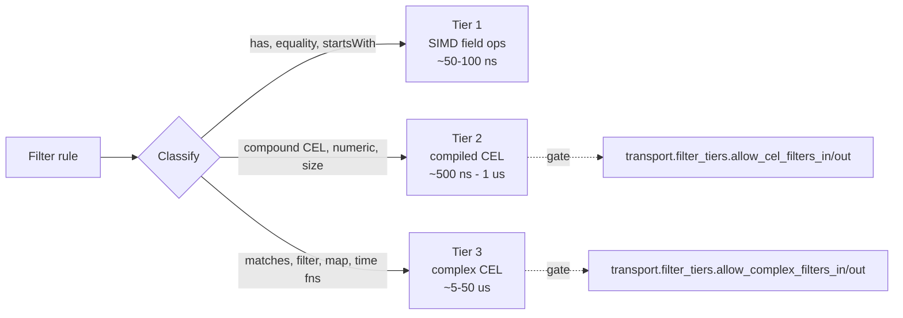

# Filter Engine

The transport filter engine drops or DLQs messages on the way in or
the way out of every transport — Kafka, gRPC, Memory, File, Pipe,
HTTP — before they reach app code. It's embedded in every
backend, zero-cost when no rules are configured, and tiered so the
common case (field-presence or equality on a top-level field) runs at
~50-100 ns per message without invoking the CEL engine at all.

---

## Why the engine exists

Operators want to:

- **Drop noise** at the wire (debug events, internal heartbeats) so it
  doesn't burn budget downstream.
- **Quarantine poison messages** to a DLQ for review without bringing
  down the pipeline.
- **Express filters in operator-language** (CEL) rather than scattering
  if-statements through transport code.
- **Pay nothing** for the engine when no filters are configured.

The three-tier design makes that last point work: the fast tier runs
without CEL, and tier classification happens at config-load — startup
fails fast if a rule lands in a tier the operator hasn't allowed.

---

## Three tiers



| Tier | Cost per message | Operations | Config gate |
|------|------------------|------------|-------------|
| **1** | ~50-100 ns | `has(field)`, `!has(field)`, `field == "literal"`, `field != "literal"`, `field.startsWith(...)`, `field.endsWith(...)`, `field.contains(...)` -- `field` may be a dotted path such as `a.b` | Always on |
| **2** | ~500 ns - 1 us | Compound CEL (`&&`, `||`), numeric comparison, multi-field access, `size()` | `transport.filter_tiers.allow_cel_filters_in` / `_out` |
| **3** | ~5-50 us | `matches()` (regex), `exists()`, `filter()`, `map()`, `all()`, `exists_one()`, `timestamp()`, `duration()` | `transport.filter_tiers.allow_complex_filters_in` / `_out` (implies tier-2) |

Tier 1 uses `sonic-rs::get_from_slice` for field extraction plus
single-segment field-name lookups via pre-compiled
`memchr::memmem::Finder` (~10-20 ns when the field name is the only
needle). It never invokes the CEL interpreter.

Tier 2 compiles the CEL expression once at startup, then evaluates
against fields extracted via SIMD.

Tier 3 enables CEL's regex / iteration / time profile (which adds
expensive operations and DoS surface — hence the separate gate).

Tier 2 and Tier 3 need the `expression` Cargo feature. Without it, a rule that classifies above Tier 1 fails at startup.

---

## Classification (no AST walking)

`classify()` decides what tier an expression sits in by **text-pattern
matching**, not AST analysis. `LazyLock` regex patterns for each
tier-1 operation are tried in order of expected frequency
(`has`, `!has`, `==`, `!=`, `startsWith`, `endsWith`, `contains`). If
none match, scan for restricted function names — match means tier 3.
Otherwise tier 2.

This is conservative on purpose: only expressions that obviously fit a
tier-1 pattern execute outside the CEL engine. Anything subtle drops
to tier 2 or 3 where the actual CEL interpreter validates the
expression.

See [src/transport/filter/classify.rs](../../src/transport/filter/classify.rs).

---

## Semantics

- **First-match wins.** Filters are evaluated in declared order; the
  first match returns its action and stops the loop. No match → message
  passes.
- **`drop` action** silently discards. Every match, `drop` or `dlq`, counts
  in the `transport_filtered_total` counter, labelled `direction` and `action`.
- **`dlq` action** produces a `FilteredDlqEntry` returned **inline** in
  `recv()`'s `WorkBatch.dlq_entries` (alongside the passing
  `WorkBatch.records`) -- the transport does **not** route to a DLQ
  directly. The caller routes `batch.dlq_entries` to the DLQ of its
  choice; they cannot be silently lost. (When the `BatchEngine` run
  loops own the receive, a `FilterDlqPolicy` governs this -- `Reject` by
  default, or `Route`/`DiscardWithMetric`.) The commit token of a dropped
  or DLQ'd record stays in `WorkBatch.commit_tokens`, so the block commit
  moves the source past it.
- **Inbound and outbound are independent.** Each transport has
  `filters_in` and `filters_out`, evaluated separately.
- **Startup fails fast** on rules above the allowed tier, on invalid
  CEL syntax, on empty expressions, and on Tier 2/3 rules over the AST
  budget (`transport.filter_tiers.budget`). A pipe built directly with
  `PipeTransport::new` starts but refuses traffic -- see
  [Where it's embedded](#where-its-embedded).

---

## Config

Two distinct cascade keys gate filter behaviour. Operators have to set
both correctly because they apply at different layers.

### `<backend>.filters_{in,out}` -- the rules themselves

Per-transport rule lists, carried on each backend's config struct (`KafkaConfig`, `GrpcConfig`, `MemoryConfig`, `FileTransportConfig`, `PipeTransportConfig`, `HttpTransportConfig`). Each rule has an `expression` (CEL text) and an `action` (`drop`, the default, or `dlq`). Rules apply at the named transport, in the named direction. They sit in the backend section under whatever cascade key the app reads -- here, a receiver built by `AnyReceiver::from_config("transport.input")`:

```yaml
transport:
  input:
    type: kafka
    kafka:
      brokers: ["kafka:9092"]
      topics: ["events"]
      filters_in:
        - expression: 'has(_internal)'
          action: drop
        - expression: 'status == "poison"'
          action: dlq
        - expression: 'severity > 3 && source != "internal"'
          action: dlq
      filters_out:
        - expression: 'has(debug)'
          action: drop
```

### `transport.filter_tiers.*` — the tier gates

Top-level gate controlling which tiers any transport is allowed to
compile. Defaults to all Tier 2/3 gates closed — first-time deployments
get Tier 1 only.

```yaml
transport:
  filter_tiers:
    allow_cel_filters_in: false       # Tier 2 (compiled CEL) inbound
    allow_cel_filters_out: false      # Tier 2 outbound
    allow_complex_filters_in: false   # Tier 3 (regex/iteration/time) inbound
    allow_complex_filters_out: false  # Tier 3 outbound
```

If a configured filter rule classifies above the allowed tier, the
transport's constructor returns `TransportError::Config(...)` and the
transport fails to start. **Fail-loud, not fail-silently** -- a
misconfigured drop/dlq rule never runs as an empty filter engine that
lets every message through. `PipeTransport::new` refuses traffic
instead -- see [Where it's embedded](#where-its-embedded).

`transport.filter_tiers.budget` bounds Tier 2/3 cost: `max_ast_nodes` (default 200) and `max_iteration_depth` (default 2) are checked at startup, and `max_payload_bytes` (default 1 MiB) at evaluation. A payload over `max_payload_bytes` skips the CEL rule, which then does not match, and counts in `transport_filter_cel_payload_skip_total` (with the `metrics` feature).

### `expression.*` -- the app-wide CEL function profile

The top-level `expression` section sets which CEL functions are usable in the app's own expressions (transforms, validators):

```yaml
expression:
  allow_regex: false        # regex matches() function
  allow_iteration: false    # filter/map/all/exists/exists_one
  allow_time: false         # time-related functions
```

Transport filters meet it in two ways:

- **Tier 2** compiles under this profile.
- **Tier 3** compiles with regex, iteration and time all unlocked, so these three flags do not apply to it. The tier gate is the only switch a Tier 3 filter needs.

The profile's function allowlist applies to both tiers.

### The tier gate decides

A filter rule like `'tag.matches("^prod-")'` classifies as Tier 3 and compiles when `transport.filter_tiers.allow_complex_filters_in` is `true`, whatever `expression.allow_regex` says. Setting `expression.allow_regex: false` does not stop regex transport filters -- close the Tier 3 gate for that.

### Reload semantics

The tier-gate config (`transport.filter_tiers.*`) is read **at
transport construction time** via
`TransportFilterTierConfig::from_cascade()`. A `ConfigReloader` update
to those keys does **not** propagate to an already-running transport
— the old gates remain in effect until the transport is reconstructed.

This is intentional: a misconfigured reload that flips a gate would
otherwise tear down a working transport mid-stream. Operators wanting
the new gate config to take effect should restart the service (or, in
K8s, roll the pod). Rule lists load the same way, so a rule change
needs a restart too.

A first-time deployment should start with all gates off — only Tier 1
filters work. Flip a gate on once Tier 2 or Tier 3 is genuinely needed
and the operator has reviewed the cost (Tier 3 is unbounded CPU; see
[Known limitations](#known-limitations)).

---

## API surface

```rust
use scalo::transport::filter::{
    TransportFilterEngine, FilterDisposition,
    FilteredBatch, FilteredDlqEntry,
    FilterAction, FilterDirection, FilterRule, FilterTier,
};

// Built once per transport from config:
let engine = TransportFilterEngine::new(
    &filters_in,
    &filters_out,
    &tier_config,
)?;

// On the hot path:
match engine.apply_inbound(&payload) {
    FilterDisposition::Pass => process(payload),
    FilterDisposition::Drop => continue,
    FilterDisposition::Dlq  => continue,   // a transport's recv() returns it in WorkBatch.dlq_entries
}

// DLQ entries come back inline from recv() -- route them per batch:
let batch = transport.recv(max).await?;
for entry in batch.dlq_entries {
    dlq_sender.send(entry).await?;
}

// Cheap fast-paths:
if !engine.has_inbound_filters() {
    /* short-circuit, skip evaluation */
}
```

`has_inbound_filters` and `has_outbound_filters` are marked
`#[inline]` so the no-filter branch becomes a single check on the hot
path.

`FilteredBatch::passthrough` constructs a batch when filters are off,
so transport code doesn't fork for the empty case.

---

## Where it's embedded

Every transport backend builds the engine at construction time from
its own config section's `filters_in` / `filters_out` plus the
`transport.filter_tiers` gates, read through
`TransportFilterTierConfig::from_cascade()`:

| Transport | Source |
|-----------|--------|
| Kafka | [src/transport/kafka/mod.rs](../../src/transport/kafka/mod.rs) |
| gRPC | [src/transport/grpc/mod.rs](../../src/transport/grpc/mod.rs) |
| Memory | [src/transport/memory/mod.rs](../../src/transport/memory/mod.rs) |
| File | [src/transport/file.rs](../../src/transport/file.rs) |
| Pipe | [src/transport/pipe.rs](../../src/transport/pipe.rs) |
| HTTP | [src/transport/http.rs](../../src/transport/http.rs) |

`PipeTransport::new` returns the transport rather than a `Result`, so a rule that fails to compile cannot fail its constructor. The pipe starts unhealthy instead: `send` returns `SendResult::Fatal` and `recv` returns `TransportError::Config`, both carrying the compile error, until it is rebuilt with valid rules. `AnySender` and `AnyReceiver` fail construction on the same rule, as for every other backend.

The engine is a no-op when both filter vectors are empty — there's no
per-message overhead beyond the inlined `has_*_filters` check.

---

## MsgPack and binary payloads

The engine targets JSON. When `apply_*` sees a payload that looks
like MsgPack (heuristic detection of MsgPack signature bytes), it
short-circuits to `Pass`. The first bypass in each direction logs a
warning, and every bypass counts in
`transport_filter_msgpack_bypass_total{direction}` (with the `metrics`
feature).

This is a deliberate choice — running JSON-shaped filters against
binary payloads would either falsely match or always reject. The engine
has no MsgPack evaluator, so a pipeline that needs to filter MsgPack
converts it to JSON upstream.

---

## Known limitations

Open gaps in the engine, by status:

| # | Item | Status | Notes |
|---|------|--------|-------|
| 7 | Constant-time string comparison for sensitive fields | Pending | Low risk; door open for timing attacks on high-entropy field values |
| 8 | Log masking for filter expression content | Pending | Expression text logged as-is at startup; expression authors should treat expressions as non-secret |
| 9 | Pre-quoted bytes fast path for `field == "value"` | Partial | `FieldExists` / `FieldNotExists` already use pre-compiled `memmem::Finder`; `FieldEquals` still uses SIMD extract + string compare |
| 10 | MsgPack payloads pass unfiltered | Acknowledged | Design choice; a one-shot warning per direction plus `transport_filter_msgpack_bypass_total` make the bypass visible |
| 12 | Tier 2/3 CEL has no time budget | Partial | `transport.filter_tiers.budget` caps AST size and iteration depth at startup and payload size at evaluation. `program.execute(&ctx)` still runs with no time cap, so a costly filter within those caps can hold the ingest thread. A time cap needs support in the upstream `cel` crate |

The items aren't blockers. Operators should know about #10 if their
pipeline mixes JSON and MsgPack.

---

## Tests and benchmarks

- Unit tests: 70 across the module (budget, classify, compiled, config, metrics, mod).
- Integration tests: 54 in `tests/transport_filter.rs` -- round-trip,
  adversarial inputs, Unicode, 100-rule lists, MsgPack heuristic.
- Benchmarks: `benches/filter_benchmark.rs` -- 8 criterion groups
  covering the no-filter baseline, tier-1 `has`, `==`, `startsWith` and a
  dotted path, first-match-at-N, tier-2 compound, tier-3 regex.

Tier-1 latency confirmed at ~50-100 ns/message on the bench machine.

---

## Related

- [transport/README.md](README.md) — trait architecture, factory, `AnySender`
- [transport/backends.md](backends.md) — per-backend wiring
- [pipeline/dlq.md](../pipeline/dlq.md) — DLQ sink backends
- [core-pillars/config.md](../core-pillars/config.md) — cascade
- [feature-flags.md](../feature-flags.md) — `transport`, `expression`
