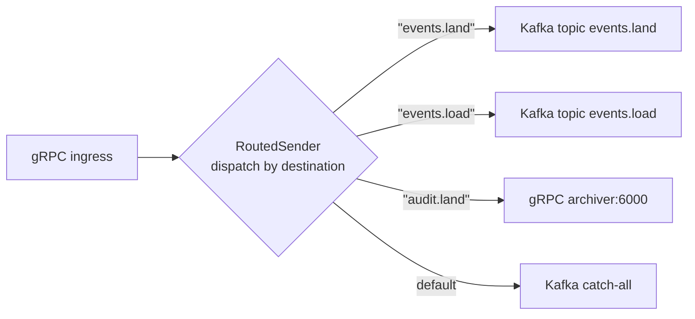

# Routing -- the named sink set

`RoutedSender` dispatches a send to one of N backend senders held under
NAMES — `loader`, `archiver`, `transform-orders` — so a routing decision
picks a name and the config decides what that name is: a Kafka topic on
the bus, a gRPC endpoint on the direct transport. Sits on top of
[`AnySender`](README.md); no new backend, no new trait.

---

## When to use it

| Stage | Routed? | Why |
|-------|---------|-----|
| `dfe-receiver` | **Yes** | A match rule sends a record to any named destination, or fans it out to several |
| `dfe-fetcher` | **Yes** | Each source maps to its own destination, plus per-record routes |
| `dfe-transform-vrl` | **Yes** | Its sink list is config-driven — one destination today, a list tomorrow |
| `dfe-transform-vector` | **Yes** | Same, though Vector owns the transform config itself |
| `dfe-loader` | No | One ClickHouse sink — 1:1 transport |
| `dfe-archiver` | No | One object-storage sink — 1:1 transport |

Push the routing decision as close to ingress as possible: a stage that
sees one inbound stream and produces one outbound stream needs a name for
its sink, not a routing table.

---

## Typical use case

A receiver accepts gRPC pushes from many tenants on one listen
socket, then fans messages out to per-tenant Kafka topics (durability)
while a small set of audit events go to a dedicated gRPC archiver
for low-latency capture.



---

## Config shape

```yaml
transport:
  output:
    type: routed
    default:
      type: kafka
      kafka:
        brokers: ["kafka:9092"]
    routes:
      events.land:
        type: kafka
        kafka:
          brokers: ["kafka:9092"]
      events.load:
        type: kafka
        kafka:
          brokers: ["kafka:9092"]
      audit.land:
        type: grpc
        grpc:
          endpoint: "http://archiver:6000"
```

Each route value is a full `TransportConfig` — any backend
[backends.md](backends.md) supports is fair game. The `default` is
optional; without it, an unknown key returns `SendResult::Fatal`.

---

## API

```rust
use std::collections::HashMap;
use scalo::transport::{
    AnySender, RoutedSender, TransportConfig, TransportSender,
};

// Build from config structs:
let mut routes = HashMap::new();
routes.insert("events.land".into(), kafka_cfg.clone());
routes.insert("audit.land".into(), grpc_cfg.clone());

let sender = RoutedSender::from_route_configs(routes, Some(default_cfg)).await?;

sender.send("events.land", payload).await;   // → Kafka topic
sender.send("audit.land", payload).await;    // → gRPC archiver
sender.send("anything-else", payload).await; // → default
```

Construct directly from pre-built senders when the config indirection
isn't useful (tests, dynamic wiring):

```rust
let mut routes = HashMap::new();
routes.insert("a".into(), AnySender::Memory(/* ... */));
let sender = RoutedSender::new(routes, Some(default_sender));
```

---

## Named destinations, and the wire key

`send` uses ONE string for both the route lookup and the backend's wire
destination, which fits a table keyed by topic. When the destination NAME
is not the wire key — a destination called `loader` whose Kafka topic is
`orders_land`, computed per record — pass the two separately:

```rust
sender.send_to("loader", "orders_land", payload).await;
```

On gRPC the key is the metadata routing key and the endpoint came from the
route's config, so the same call works unchanged on both transports. That
is what lets one match rule compile to a topic on the bus and an endpoint
on the direct transport.

---

## Fan-out

A rule's destination may be a LIST. `send_fanout` delivers one payload to
every named destination and is acknowledged only when every one has
accepted — this is how a matched record reaches the loader AND the
archiver without a broker in the path:

```rust
sender.send_fanout(&["loader", "archiver"], "orders_land", payload).await;
```

The first `Backpressured`/`Fatal` short-circuits and is returned, so the
caller retries the whole fan-out and re-delivers to whichever destinations
already accepted: at-least-once, duplicates never loss — the same contract
as `send_batch`'s per-record fallback. An empty list is `Ok`.

---

## Batches

`send_batch` groups a block by the route each record's `key` resolves to
and hands each group to its sender in ONE call, so a routed block keeps
whatever native batch the backend has — gRPC's single `RouteBatch` and its
all-or-nothing acceptance — instead of degrading to one `send` per record.
Order is preserved within a group, and every record is counted on its own
route's metrics exactly as `send` counts it. Two things follow from
grouping that the per-record default cannot give you: an unroutable record
fails the whole block with nothing sent (the routing is deterministic, so a
retry would re-deliver the same prefix and fail again forever), and a
`Backpressured`/`Fatal` short-circuits at group granularity — the failing
destination's result is the block's result, groups after it stay unsent for
the caller's retry. An empty block is `Ok`. `send_batch_fanout` is the
batch form of `send_fanout`: the whole block to every named destination,
one call each.

```rust
sender.send_batch(&workbatch.records).await;
sender.send_batch_fanout(&["loader", "archiver"], &workbatch.records).await;
```

---

## Backpressure

A routed send NEVER retries and NEVER routes to a DLQ. It returns the
chosen backend's `SendResult` unchanged so the caller applies its own
policy — the fetcher holds the batch and stalls its scheduler, the
receiver back-pressures its ingest. A DLQ that only exists on the bus is
not a fallback a brokerless deployment can take.

Bounded retry with backoff is [`SinkStack`](../pipeline/sink-stack.md)'s
job, and it composes on top: `RoutedSender` implements `TransportSender`,
so a stack wraps the whole set.

---

## Composition with `AnySender`

`RoutedSender` **owns** N `AnySender`s — one per route plus the
default. Each `AnySender` is itself enum-dispatched over the seven
backends. So `RoutedSender::send`:

1. `HashMap::get(destination)` to find the route (or fall back to default).
2. `AnySender::send(destination, payload).await` on the chosen sender.
3. Backend's own `send` runs — Kafka, gRPC, etc.

Two layers of dispatch, both monomorphised by the compiler. The
route lookup is a `HashMap<String, AnySender>::get` — single hash
+ equality compare, no allocation when the key is `&str`.

`RoutedSender` itself implements `TransportSender` — anywhere an
app expects `impl TransportSender`, a routed sender drops in. It
implements `TransportBase` too — `close()` cascades to every route
and the default, `is_healthy()` reports `false` if any constituent
sender is unhealthy.

---

## Performance

Per `send()` call, on top of the chosen backend's own cost:

| Step | Cost |
|------|------|
| `HashMap::get(&str)` lookup | ~20-40 ns (SipHash + compare) |
| Match on `AnySender` variant | <5 ns (jump table) |
| Backend `send` | µs to ms — dominates |

The routing overhead is at most 1% of any real backend's send cost.
No allocation, no `Arc::clone`, no async indirection. The metric
`dfe_transport_sent_total{transport="routed", route=<key>}` records
the route taken.

---

## Empty / missing routes

Behaviour when `destination` is not in `routes`:

| Config | Result |
|--------|--------|
| `default` is set | Falls through to the default sender |
| `default` is unset | `SendResult::Fatal(TransportError::Config(...))` |

Mark a default unless the calling code is OK with the fatal — for
ingress paths this is usually wanted (unknown tenant → catch-all
"unknown.tenant" topic for ops to triage). For audit paths the fatal
is the right default (no silent drop).

For "route exists but send fails", `RoutedSender` returns the
chosen backend's `SendResult` unchanged — backpressure, fatal, and
filter-DLQ propagate up. Caller distinguishes by matching on the
result.

That holds for `send` and `send_to`. The block and fan-out forms (`send_batch`, `send_fanout`, `send_batch_fanout`) count a `FilteredDlq` answer as handled and return `Ok`, as the `TransportSender::send_batch` contract says, so the caller never sees it. To dead-letter those records instead, screen the block first: `dead_letter_reason` answers for the route each record's key selects, and `BatchEngine::pipeline(..).sender(&routed)` does that screening and routes the records to its DLQ. `confirms_delivery` is the weakest across every route and the default.

---

## API surface

| Item | Purpose |
|------|---------|
| `RoutedSender::new(routes, default)` | Construct from pre-built `AnySender`s |
| `RoutedSender::from_route_configs(routes, default).await` | Construct from per-route `TransportConfig`s |
| `RoutedSender::send(destination, payload).await` | Dispatch by destination, fall to default if missing |
| `RoutedSender::send_to(destination, key, payload).await` | Dispatch by NAME, with the wire key supplied separately |
| `RoutedSender::send_fanout(&[destination], key, payload).await` | One payload to every named destination |
| `RoutedSender::send_batch(records).await` | A block grouped by destination, one call per group |
| `RoutedSender::send_batch_fanout(&[destination], records).await` | The whole block to every named destination |
| `RoutedSender::dead_letter_reason(record)` | The screen of the route the record's key selects |
| `RoutedSender::confirms_delivery()` | The weakest confirmation across every route and the default |
| `RoutedSender::route_keys() -> Vec<&str>` | List configured route keys |
| `RoutedSender::has_route(key) -> bool` | Check if a specific key has a route |
| `RoutedSender::has_default() -> bool` | Check if a default sender is wired |
| `RoutedSender::destination_health() -> Vec<(&str, bool)>` | Per-destination health, `"default"` included |
| `RoutedSender::is_destination_healthy(name) -> bool` | Health of the sender that resolves `name` |
| `RoutedSender::any_healthy() -> bool` | At least one sender healthy — the readiness form |
| `RoutedSender::close().await` | Cascade close to every route + default |
| `RoutedSender::is_healthy() -> bool` | True only if every constituent sender is healthy |
| `RoutedSender::name() -> &'static str` | Returns `"routed"` |

Source: [../../src/transport/routed.rs](../../src/transport/routed.rs).

---

## Related

- [README.md](README.md) — traits, `AnySender`, enum dispatch
- [backends.md](backends.md) — concrete backends each route can pick
- [filter-engine.md](filter-engine.md) — filters run per-backend, after routing
- [../architecture.md](../architecture.md) — data-plane stage model
- [../integration.md](../integration.md) — wiring for receiver/fetcher
- [../feature-flags.md](../feature-flags.md) — feature flags per backend
